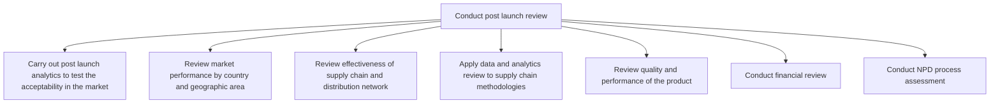
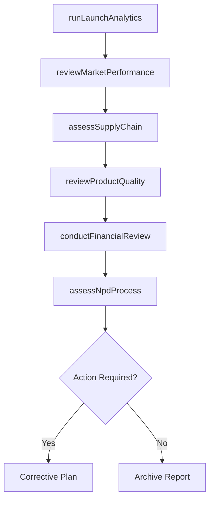

# Conduct post launch review

> Business-as-Code definition for post-launch product review. Models the analytics, market performance analysis, supply chain assessment, quality review, and financial evaluation performed after a product reaches the market.

## Overview

Learning from either a test or a full production run within the consumer market. Companies use this as an opportunity to both test and react to new products, ideas, or innovations based on the initial reaction of consumers on an individual level. Within this process, analytics are used to determine the relative success of a new product offering. Within this process, companies will launch key analytics to test a products acceptance. They will also review market performance and compare to similar products and against the business case or the financial plan. Companies can also measure the effectiveness of their supply chain network, and can apply what is learned from the post launch review to other new products, processes, and procedures to ensure and enhance the product quality.

## Process Hierarchy



## GraphDL

```yaml
conduct:
  object: Post Launch Review
  actor: ProductAnalyst
  result: PostLaunchReport
```

## Actions

| Action | Description |
|--------|-------------|
| runLaunchAnalytics | Execute market acceptance analytics on newly launched products |
| reviewMarketPerformance | Analyze sales and adoption metrics by country and region |
| assessSupplyChain | Evaluate supply chain and distribution network effectiveness |
| reviewProductQuality | Analyze product quality data and customer complaint trends |
| conductFinancialReview | Compare actual financial performance against the business case |
| assessNpdProcess | Evaluate the new product development process for lessons learned |

## Events

| Event | Description |
|-------|-------------|
| launchAnalyticsCompleted | Market acceptance analytics finalized and reported |
| marketPerformanceReviewed | Regional market performance data compiled and analyzed |
| supplyChainAssessed | Supply chain effectiveness evaluation completed |
| productQualityReviewed | Product quality and reliability assessment completed |
| financialReviewCompleted | Financial performance comparison against business case finalized |
| npdProcessAssessed | New product development process assessment documented |

## Searches

| Search | Description |
|--------|-------------|
| getPostLaunchMetrics | Retrieve post-launch performance metrics for a product |
| getRegionalPerformance | Access market performance data broken down by geography |
| getQualityTrends | Retrieve product quality and defect trend data |
| getFinancialVariance | Access variance between projected and actual financial performance |

## Process Flow



## RACI Matrix

| Activity | Responsible | Accountable | Consulted | Informed |
|----------|-------------|-------------|-----------|----------|
| runLaunchAnalytics | MarketAnalyst | VP Marketing | Sales, Product | Executive |
| reviewMarketPerformance | MarketAnalyst | VP Marketing | RegionalManagers | Finance |
| assessSupplyChain | SupplyChainAnalyst | VP Operations | Logistics, Procurement | Product |
| conductFinancialReview | FinanceAnalyst | CFO | Product, Sales | Board |

## Sub-Processes

| ID | Name | Description |
|----|------|-------------|
| 2.1.2.5.1 | Carry out post launch analytics to test the acceptability in the market | Measuring the performance of marketing once the product/services are launched. This broadly covers m |
| 2.1.2.5.2 | Review market performance by country and geographic area | Conducting customer and market analysis to review progress and identify opportunities for increasing |
| 2.1.2.5.3 | Review effectiveness of supply chain and distribution network | Determining the performance of supply chain to all departments and logistics from input to shop floo |
| 2.1.2.5.4 | Apply data and analytics review to supply chain methodologies | Collecting and examining raw data with the purpose of drawing conclusions about that information and |
| 2.1.2.5.5 | Review quality and performance of the product | Identifying the quality and performance of the product/service delivered to customers. Analyze data  |
| 2.1.2.5.6 | Conduct financial review | Evaluating organization's financial reports and financial reporting processes. Review and document t |
| 2.1.2.5.7 | Conduct NPD process assessment | Analyzing the steps involved in the development of new product, its effect on existing product, reso |

## Related Processes

| Process | Relationship |
|---------|-------------|
| 2.1.2.2 Introduce new products/services | Upstream - launched products enter post-launch review |
| 2.1.2.4 Identify and refine performance indicators | Downstream - review findings refine product KPIs |
| 2.3.4 Support and implement changes to product manufacturing and service delivery process | Downstream - review findings drive manufacturing improvements |

## Related Departments

| Department | Role |
|-----------|------|
| Product Management | Coordinates post-launch review activities |
| Marketing | Provides market performance and campaign data |
| Finance | Conducts financial review and ROI analysis |
| Supply Chain | Assesses distribution effectiveness |
| Quality Assurance | Reviews product quality and reliability |

## Related Occupations

| Occupation | Involvement |
|-----------|-------------|
| Product Analyst | Compiles and analyzes post-launch data |
| Market Research Analyst | Gathers market acceptance data |
| Financial Analyst | Conducts post-launch financial review |

## KPIs

| KPI | Description | Unit |
|-----|-------------|------|
| Post-Launch Review Cycle Time | Duration from launch to completed review | Days |
| Action Item Closure Rate | Percentage of review-generated action items resolved | % |
| Review Coverage | Percentage of launched products receiving formal post-launch review | % |
| Corrective Action Effectiveness | Percentage of corrective actions that achieve intended outcomes | % |

## Usage

```typescript
import { conductPostLaunchReview } from '@headlessly/conduct-post-launch-review'

const reviewer = conductPostLaunchReview()

// Run post-launch analytics on a newly launched product
const analytics = await reviewer.runLaunchAnalytics({
  productId: 'prod-2025-a',
  launchDate: '2025-03-15',
  reviewPeriod: 90
})

// Conduct the financial review component
const financials = await reviewer.conductFinancialReview({
  productId: 'prod-2025-a',
  compareAgainst: 'business-case-v2'
})
```
