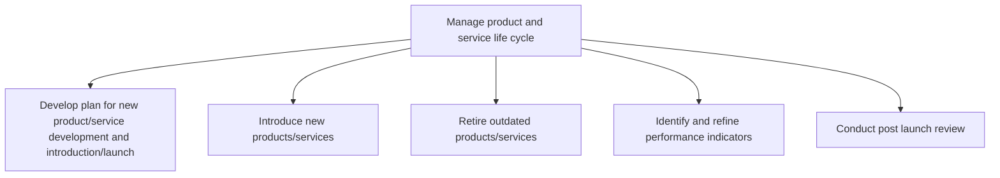
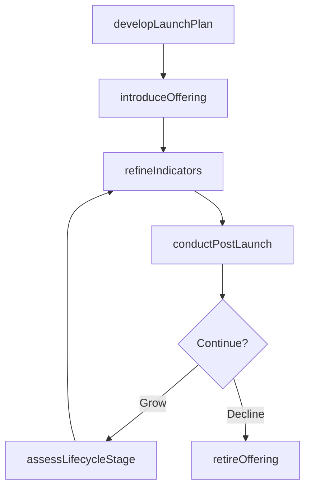

# Manage product and service life cycle

> Business-as-Code definition for product and service lifecycle management. Models the planning, introduction, performance monitoring, retirement, and post-launch review of products and services throughout their market lifespan.

## Overview

Manage the introduction and withdrawal of products/services. Administer associated changes, namely measuring the performance of new solution offerings and the revision of master files in the archives.

## Process Hierarchy



## GraphDL

```yaml
manage:
  object: Product And Service Life Cycle
  actor: LifecycleManager
  result: LifecycleDecision
```

## Actions

| Action | Description |
|--------|-------------|
| developLaunchPlan | Create a comprehensive plan for product introduction and market launch |
| introduceOffering | Execute the market introduction of a new product or service |
| retireOffering | Withdraw outdated or underperforming products from the market |
| refineIndicators | Identify and calibrate performance indicators for lifecycle tracking |
| conductPostLaunch | Perform post-launch review analyzing market acceptance and financials |
| assessLifecycleStage | Determine the current lifecycle stage of a product or service |

## Events

| Event | Description |
|-------|-------------|
| launchPlanDeveloped | Product introduction and launch plan completed and approved |
| offeringIntroduced | New product or service successfully launched to market |
| offeringRetired | Product or service withdrawn from market and archived |
| indicatorsRefined | Performance indicators calibrated and approved |
| postLaunchReviewed | Post-launch review completed with findings documented |
| lifecycleStageAssessed | Product lifecycle stage determination completed |

## Searches

| Search | Description |
|--------|-------------|
| getLifecycleStatus | Retrieve current lifecycle stage and health metrics for a product |
| listActiveProducts | List all products filtered by lifecycle stage, category, or launch date |
| getRetirementCandidates | Identify products approaching end-of-life or underperforming thresholds |
| getLaunchPipeline | Access upcoming product launches with scheduled dates and readiness |

## Process Flow



## RACI Matrix

| Activity | Responsible | Accountable | Consulted | Informed |
|----------|-------------|-------------|-----------|----------|
| developLaunchPlan | ProductManager | VP Product | Marketing, Engineering | Executive |
| introduceOffering | LaunchManager | VP Marketing | Sales, Operations | Finance |
| retireOffering | PortfolioManager | VP Product | Legal, CustomerSuccess | Sales |
| conductPostLaunch | ProductAnalyst | VP Product | Finance, SupplyChain | Executive |

## Sub-Processes

| ID | Name | Description |
|----|------|-------------|
| 2.1.2.1 | Develop plan for new product/service development and introduction/launch | Developing a program and managing a perspective for new product/service introduction and launch. |
| 2.1.2.2 | Introduce new products/services | Launching revamped product/service portfolio in to the market. Introduction in to the marketplace is |
| 2.1.2.3 | Retire outdated products/services | Removing nonconforming products and services. Withdraw those products/services that do not conform t |
| 2.1.2.4 | Identify and refine performance indicators | Attuning the performance measures of products/services to better reflect the revamped portfolio of s |
| 2.1.2.5 | Conduct post launch review | Learning from either a test or a full production run within the consumer market. Companies use this  |

## Related Processes

| Process | Relationship |
|---------|-------------|
| 2.1.1 Manage product and service portfolio | Upstream - portfolio decisions drive lifecycle actions |
| 2.3 Develop products and services | Parallel - development feeds introduction stage |
| 3.0 Market and sell products and services | Downstream - launched products enter sales channels |

## Related Departments

| Department | Role |
|-----------|------|
| Product Management | Owns lifecycle stage transitions and launch planning |
| Marketing | Drives market introduction and post-launch analysis |
| Finance | Monitors financial performance across lifecycle stages |
| Operations | Manages production scaling and retirement logistics |
| Customer Success | Provides customer adoption data and retirement impact analysis |

## Related Occupations

| Occupation | Involvement |
|-----------|-------------|
| Product Lifecycle Manager | Oversees lifecycle stage transitions and decisions |
| Product Manager | Plans launches and defines performance indicators |
| Market Analyst | Conducts post-launch market performance review |
| Operations Manager | Coordinates production ramp-up and wind-down |

## KPIs

| KPI | Description | Unit |
|-----|-------------|------|
| Time-to-Market | Average elapsed time from concept approval to market launch | Weeks |
| Post-Launch Success Rate | Percentage of products meeting first-year performance targets | % |
| Portfolio Turnover Rate | Rate of product introductions and retirements per year | Count/Year |
| Lifecycle Revenue Contribution | Revenue contribution by lifecycle stage | Currency |

## Usage

```typescript
import { manageProductAndServiceLifeCycle } from '@headlessly/manage-product-and-service-life-cycle'

const lifecycle = manageProductAndServiceLifeCycle()

// Develop a launch plan for a new product
const plan = await lifecycle.developLaunchPlan({
  productId: 'prod-892',
  targetLaunchDate: '2026-Q2',
  channels: ['direct', 'partner', 'online'],
  regions: ['NA', 'EMEA']
})

// Conduct post-launch review after market introduction
const review = await lifecycle.conductPostLaunch({
  productId: 'prod-892',
  reviewPeriod: '90-days',
  metrics: ['revenue', 'adoption', 'customer-satisfaction']
})

// Retire an underperforming product
await lifecycle.retireOffering({
  productId: 'prod-341',
  sunsetDate: '2026-12-31',
  migrationPath: 'prod-892'
})
```
