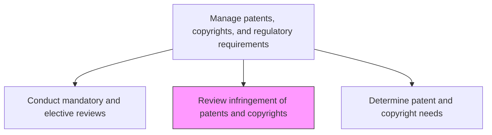
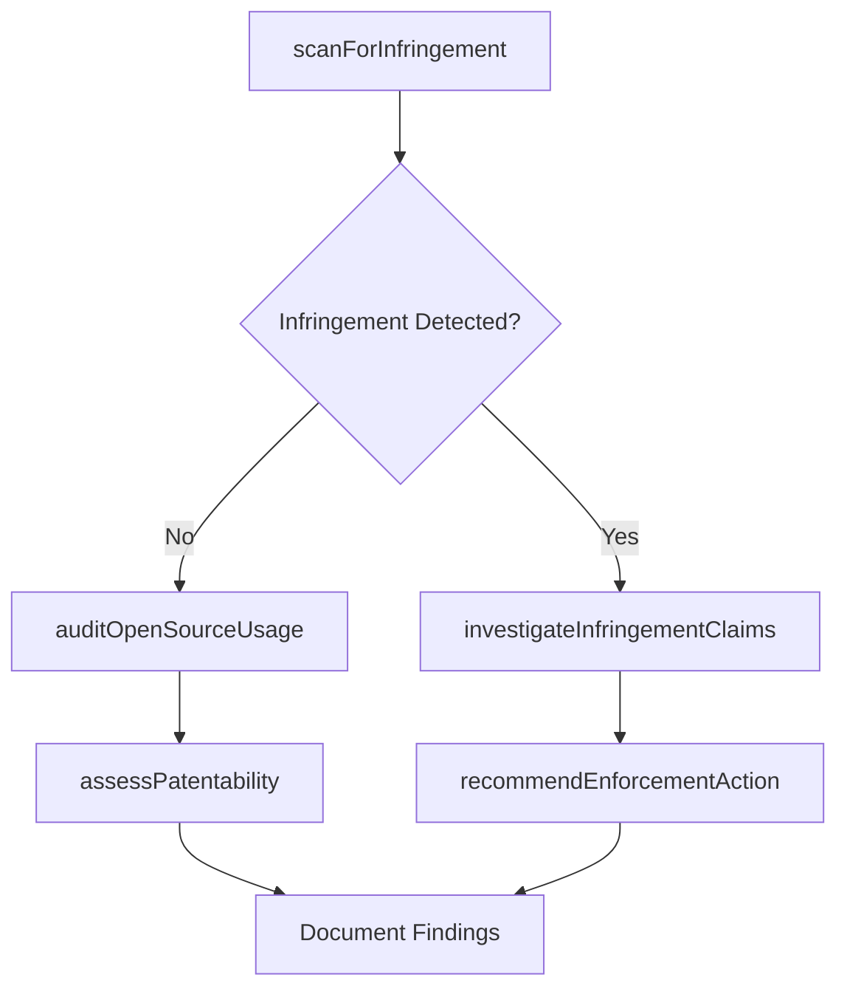

# Review infringement of patents and copyrights

> Business-as-Code definition for reviewing patent and copyright infringement. Models IP infringement scanning, open source license compliance, and infringement risk assessment.

## Overview

Reviewing activities in regards to patentability and infringement. The usage of Open Source in commercial product development will be reviewed in regard to licensing, community development, etc.

## Process Hierarchy



## GraphDL

```yaml
review:
  object: Infringement Of Patents And Copyrights
  actor: IpCounsel
  result: InfringementAssessmentReport
```

## Actions

| Action | Description |
|--------|-------------|
| scanForInfringement | Monitor market and competitor activities for potential IP violations |
| auditOpenSourceUsage | Review open source components used in products for license compliance |
| assessPatentability | Evaluate new inventions for patentability and prior art conflicts |
| investigateInfringementClaims | Conduct detailed investigation of reported infringement cases |
| recommendEnforcementAction | Propose legal or business responses to confirmed infringement |

## Events

| Event | Description |
|-------|-------------|
| infringementScanCompleted | Market and competitor monitoring cycle completed |
| openSourceAuditCompleted | Open source license compliance review finalized |
| patentabilityAssessed | New invention patentability evaluation completed |
| infringementClaimInvestigated | Infringement investigation concluded with findings |
| enforcementActionRecommended | Legal response to infringement proposed |

## Searches

| Search | Description |
|--------|-------------|
| getInfringementAlerts | Retrieve active infringement monitoring alerts |
| getOpenSourceDependencies | List open source components and their license types |
| getPatentLandscape | Access prior art and patent landscape analysis |

## Process Flow



## RACI Matrix

| Activity | Responsible | Accountable | Consulted | Informed |
|----------|-------------|-------------|-----------|----------|
| scanForInfringement | IpCounsel | GeneralCounsel | Engineering | Product |
| auditOpenSourceUsage | IpCounsel | GeneralCounsel | Engineering | Legal |
| recommendEnforcementAction | PatentAttorney | GeneralCounsel | Executive | Board |

## Related Processes

| Process | Relationship |
|---------|-------------|
| 2.1.3.3 Determine patent and copyright needs | Related - infringement review informs IP protection strategy |
| 2.1.3.1 Conduct mandatory and elective reviews | Upstream - mandatory reviews may trigger infringement investigation |
| 6.5.3 Manage copyrights and patents | Related - enterprise IP management |

## Related Departments

| Department | Role |
|-----------|------|
| Legal | Leads infringement investigation and enforcement |
| Engineering | Provides technical analysis of infringement claims |
| Product Management | Identifies products at risk of infringement exposure |

## Related Occupations

| Occupation | Involvement |
|-----------|-------------|
| IP Counsel | Leads infringement review and assessment |
| Patent Attorney | Conducts patentability and prior art analysis |
| Software Engineer | Supports open source compliance audits |

## KPIs

| KPI | Description | Unit |
|-----|-------------|------|
| Infringement Detection Rate | Number of potential infringements identified per review cycle | Count/Cycle |
| Open Source Compliance Rate | Percentage of products with fully compliant open source usage | % |
| Investigation Resolution Time | Average time from infringement detection to resolution | Days |

## Usage

```typescript
import { reviewInfringementOfPatentsAndCopyrights } from '@headlessly/review-infringement-of-patents-and-copyrights'

const ipReviewer = reviewInfringementOfPatentsAndCopyrights()

// Scan for potential patent infringement
const alerts = await ipReviewer.scanForInfringement({
  patentIds: ['pat-001', 'pat-002', 'pat-003'],
  markets: ['north-america', 'europe']
})

// Audit open source usage in a product
const audit = await ipReviewer.auditOpenSourceUsage({
  productId: 'prod-2025-a',
  licenseTypes: ['GPL', 'MIT', 'Apache-2.0', 'LGPL']
})
```
