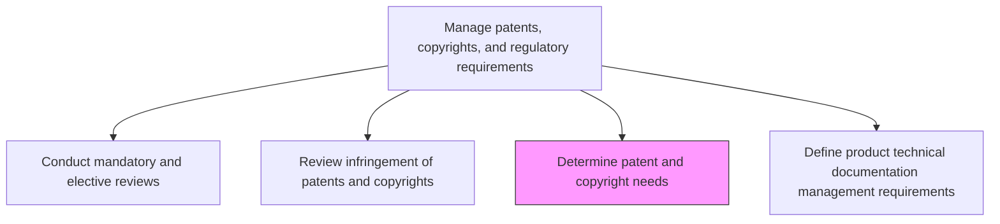
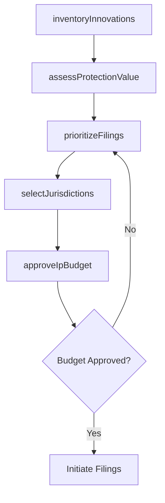

# Determine patent and copyright needs

> Business-as-Code definition for determining patent and copyright needs. Models IP opportunity assessment, protection priority setting, and filing decision governance.

## Overview

Determining the business need for patents and copyrights. The patents and copyrights are managed by Manage copyrights and patents [11062].

## Process Hierarchy



## GraphDL

```yaml
determine:
  object: Patent And Copyright Needs
  actor: IpStrategyManager
  result: IpProtectionPlan
```

## Actions

| Action | Description |
|--------|-------------|
| inventoryInnovations | Catalog new inventions, designs, and creative works eligible for protection |
| assessProtectionValue | Evaluate the commercial and strategic value of protecting each innovation |
| prioritizeFilings | Rank IP protection opportunities based on business impact and risk |
| selectJurisdictions | Determine geographic jurisdictions for patent and copyright filings |
| approveIpBudget | Authorize the budget required for filing and maintaining IP protections |

## Events

| Event | Description |
|-------|-------------|
| innovationsInventoried | Eligible inventions and works cataloged |
| protectionValueAssessed | Commercial value assessment of IP opportunities completed |
| filingsPrioritized | IP protection priorities ranked and documented |
| jurisdictionsSelected | Filing jurisdictions determined |
| ipBudgetApproved | IP protection budget authorized |

## Searches

| Search | Description |
|--------|-------------|
| getInnovationInventory | Retrieve list of innovations awaiting IP protection decisions |
| getFilingPriorities | Access prioritized list of recommended IP filings |
| getIpBudgetStatus | Retrieve IP filing budget allocations and expenditures |

## Process Flow



## RACI Matrix

| Activity | Responsible | Accountable | Consulted | Informed |
|----------|-------------|-------------|-----------|----------|
| inventoryInnovations | IpStrategyManager | GeneralCounsel | Engineering, R&D | Product |
| assessProtectionValue | IpCounsel | GeneralCounsel | Strategy, Finance | Executive |
| approveIpBudget | IpStrategyManager | CFO | Legal | Board |

## Related Processes

| Process | Relationship |
|---------|-------------|
| 2.1.3.2 Review infringement of patents and copyrights | Related - infringement landscape informs protection needs |
| 2.1.3.1 Conduct mandatory and elective reviews | Upstream - reviews may identify unprotected innovations |
| 6.5.3 Manage copyrights and patents | Downstream - determined needs drive IP management activities |

## Related Departments

| Department | Role |
|-----------|------|
| Legal | Leads IP needs assessment and filing recommendations |
| R&D | Identifies patentable inventions and innovations |
| Finance | Approves IP protection budgets |

## Related Occupations

| Occupation | Involvement |
|-----------|-------------|
| IP Strategy Manager | Leads IP needs determination process |
| Patent Attorney | Assesses patentability and filing requirements |
| Research Scientist | Identifies innovations for protection |

## KPIs

| KPI | Description | Unit |
|-----|-------------|------|
| Innovation-to-Filing Ratio | Percentage of cataloged innovations that proceed to filing | % |
| IP Portfolio Value | Estimated commercial value of the IP portfolio | Currency |
| Filing Decision Cycle Time | Time from innovation disclosure to filing decision | Days |

## Usage

```typescript
import { determinePatentAndCopyrightNeeds } from '@headlessly/determine-patent-and-copyright-needs'

const ipPlanner = determinePatentAndCopyrightNeeds()

// Inventory innovations eligible for protection
const innovations = await ipPlanner.inventoryInnovations({
  departments: ['R&D', 'Engineering'],
  period: '2025',
  types: ['utility-patent', 'design-patent', 'copyright']
})

// Prioritize filings based on business impact
const priorities = await ipPlanner.prioritizeFilings({
  innovations: innovations.map(i => i.id),
  criteria: { commercialValue: 0.4, competitiveAdvantage: 0.3, defensiveValue: 0.3 }
})
```
