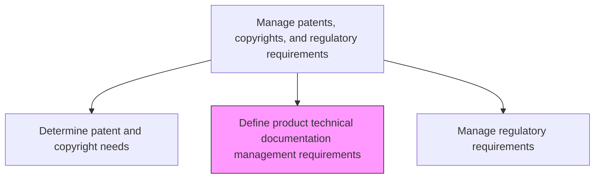
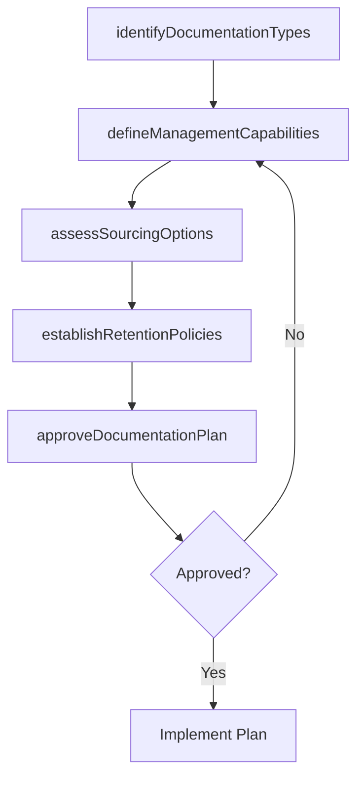

# Define product technical documentation management requirements

> Business-as-Code definition for defining product technical documentation management requirements. Models documentation capability planning, sourcing decisions, and lifecycle support documentation governance.

## Overview

Defining sourcing and procurement requirements for new product technical documentation management. Make sourcing-based decisions that identify the capabilities that will be required in order to launch the new product. This documentation will be used to support the product following entry into service. It is compiled and managed in Manage product and process related data [12082], but the capability to manage and maintain this documentation must be defined and established.

## Process Hierarchy



## GraphDL

```yaml
define:
  object: Product Technical Documentation Management Requirements
  actor: TechnicalDocumentationManager
  result: DocumentationManagementPlan
```

## Actions

| Action | Description |
|--------|-------------|
| identifyDocumentationTypes | Catalog the types of technical documentation required for the product lifecycle |
| defineManagementCapabilities | Specify the systems, tools, and workflows needed for documentation management |
| assessSourcingOptions | Evaluate internal versus external sourcing for documentation creation and maintenance |
| establishRetentionPolicies | Define retention periods, archival rules, and disposal procedures |
| approveDocumentationPlan | Formally authorize the technical documentation management plan |

## Events

| Event | Description |
|-------|-------------|
| documentationTypesIdentified | Required documentation types cataloged for the product |
| managementCapabilitiesDefined | Systems and workflow requirements specified |
| sourcingOptionsAssessed | Make-or-buy analysis for documentation completed |
| retentionPoliciesEstablished | Document retention and archival rules defined |
| documentationPlanApproved | Technical documentation management plan authorized |

## Searches

| Search | Description |
|--------|-------------|
| getDocumentationRequirements | Retrieve documentation requirements by product or product line |
| getSourcingDecisions | Access documentation sourcing decisions and rationale |
| getRetentionPolicies | Retrieve document retention policies by type |

## Process Flow



## RACI Matrix

| Activity | Responsible | Accountable | Consulted | Informed |
|----------|-------------|-------------|-----------|----------|
| identifyDocumentationTypes | TechnicalDocumentationManager | VP Engineering | Product, Quality | Support |
| defineManagementCapabilities | TechnicalDocumentationManager | VP Engineering | IT | Operations |
| approveDocumentationPlan | TechnicalDocumentationManager | VP Product | Legal, Regulatory | AllDepartments |

## Related Processes

| Process | Relationship |
|---------|-------------|
| 2.1.4 Manage product and service master data | Downstream - documentation requirements feed master data governance |
| 2.1.3.5 Manage regulatory requirements | Related - regulatory documentation is a subset of technical documentation |
| 2.3.1.6 Document design specifications | Downstream - design documentation follows defined requirements |

## Related Departments

| Department | Role |
|-----------|------|
| Engineering | Defines technical documentation needs and standards |
| Technical Publications | Creates and maintains product documentation |
| IT | Provides documentation management systems and infrastructure |

## Related Occupations

| Occupation | Involvement |
|-----------|-------------|
| Technical Documentation Manager | Leads requirements definition |
| Technical Writer | Creates product documentation |
| Information Architect | Designs documentation structure and workflows |

## KPIs

| KPI | Description | Unit |
|-----|-------------|------|
| Documentation Coverage | Percentage of products with complete documentation management plans | % |
| Sourcing Decision Cycle Time | Time from requirements definition to sourcing decision | Days |
| Retention Compliance | Percentage of documents meeting retention policy requirements | % |

## Usage

```typescript
import { defineProductTechnicalDocumentationManagementRequirements } from '@headlessly/define-product-technical-documentation-management-requirements'

const docManager = defineProductTechnicalDocumentationManagementRequirements()

// Identify required documentation types for a new product
const docTypes = await docManager.identifyDocumentationTypes({
  productId: 'prod-2025-a',
  categories: ['userManual', 'serviceGuide', 'partsCatalog', 'regulatoryFiling']
})

// Assess sourcing options for documentation creation
const sourcing = await docManager.assessSourcingOptions({
  documentTypes: docTypes.map(d => d.id),
  evaluationCriteria: ['cost', 'quality', 'turnaroundTime']
})
```
