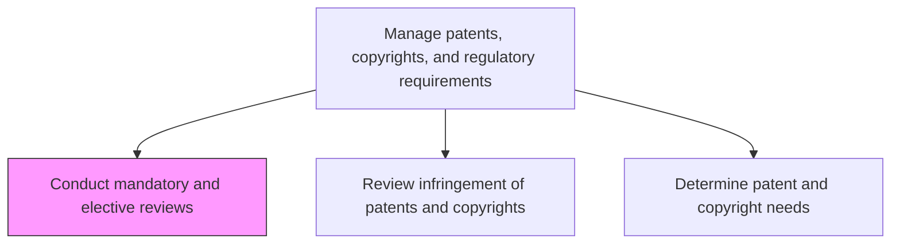
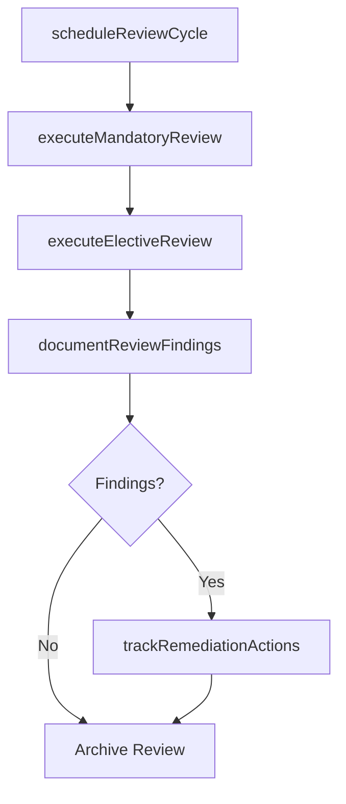

# Conduct mandatory and elective reviews

> Business-as-Code definition for conducting mandatory and elective IP and regulatory reviews. Models compliance audit scheduling, review execution, and policy enforcement for intellectual property protection.

## Overview

Conducting necessary performance reviews on enforcement of processes and steps to ensure protection. Determine policies and reviews for Manage patents, copyrights, and regulatory requirements [19985].

## Process Hierarchy



## GraphDL

```yaml
conduct:
  object: Mandatory And Elective Reviews
  actor: ComplianceOfficer
  result: ReviewCompletionReport
```

## Actions

| Action | Description |
|--------|-------------|
| scheduleReviewCycle | Plan mandatory and elective review timelines and assignments |
| executeMandatoryReview | Perform required compliance reviews per regulatory schedule |
| executeElectiveReview | Conduct discretionary reviews for areas of elevated risk |
| documentReviewFindings | Record observations, gaps, and corrective action items |
| trackRemediationActions | Monitor progress on identified corrective actions |

## Events

| Event | Description |
|-------|-------------|
| reviewCycleScheduled | Review calendar and assignments established |
| mandatoryReviewExecuted | Required compliance review completed |
| electiveReviewExecuted | Discretionary review completed |
| reviewFindingsDocumented | Observations and corrective actions recorded |
| remediationActionsTracked | Corrective action progress updated |

## Searches

| Search | Description |
|--------|-------------|
| getReviewSchedule | Retrieve upcoming and past review timelines |
| getReviewFindings | Access findings and action items from completed reviews |
| getRemediationStatus | Retrieve corrective action progress by review |

## Process Flow



## RACI Matrix

| Activity | Responsible | Accountable | Consulted | Informed |
|----------|-------------|-------------|-----------|----------|
| scheduleReviewCycle | ComplianceOfficer | GeneralCounsel | RegulatoryAffairs | AllDepartments |
| executeMandatoryReview | ComplianceOfficer | GeneralCounsel | Engineering, Quality | Executive |
| documentReviewFindings | ComplianceOfficer | GeneralCounsel | Legal | Product |

## Related Processes

| Process | Relationship |
|---------|-------------|
| 2.1.3.2 Review infringement of patents and copyrights | Downstream - review findings may trigger infringement investigation |
| 2.1.3.5 Manage regulatory requirements | Related - regulatory reviews are a subset of mandatory reviews |
| 2.3.1.7 Conduct mandatory and elective external reviews | Related - external reviews complement internal reviews |

## Related Departments

| Department | Role |
|-----------|------|
| Legal | Leads review execution and findings documentation |
| Quality Assurance | Supports review evidence and audit trails |
| Regulatory Affairs | Provides regulatory review requirements |

## Related Occupations

| Occupation | Involvement |
|-----------|-------------|
| Compliance Officer | Leads mandatory and elective review execution |
| IP Counsel | Provides IP-specific review expertise |
| Quality Auditor | Supports evidence collection and documentation |

## KPIs

| KPI | Description | Unit |
|-----|-------------|------|
| Review Completion Rate | Percentage of scheduled reviews completed on time | % |
| Finding Resolution Rate | Percentage of review findings resolved within target timeline | % |
| Review Coverage | Percentage of IP and regulatory domains reviewed per cycle | % |

## Usage

```typescript
import { conductMandatoryAndElectiveReviews } from '@headlessly/conduct-mandatory-and-elective-reviews'

const reviewer = conductMandatoryAndElectiveReviews()

// Schedule the review cycle
const schedule = await reviewer.scheduleReviewCycle({
  period: 'Q2-2025',
  mandatoryReviews: ['patent-compliance', 'regulatory-alignment'],
  electiveReviews: ['open-source-licensing']
})

// Execute a mandatory review
const findings = await reviewer.executeMandatoryReview({
  reviewId: schedule.mandatoryReviews[0].id,
  scope: 'all-active-patents'
})
```
