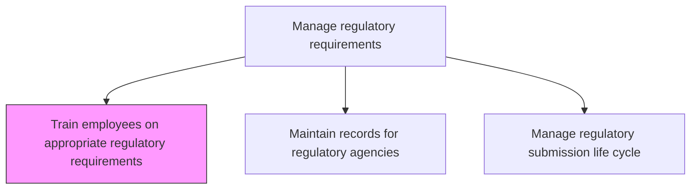
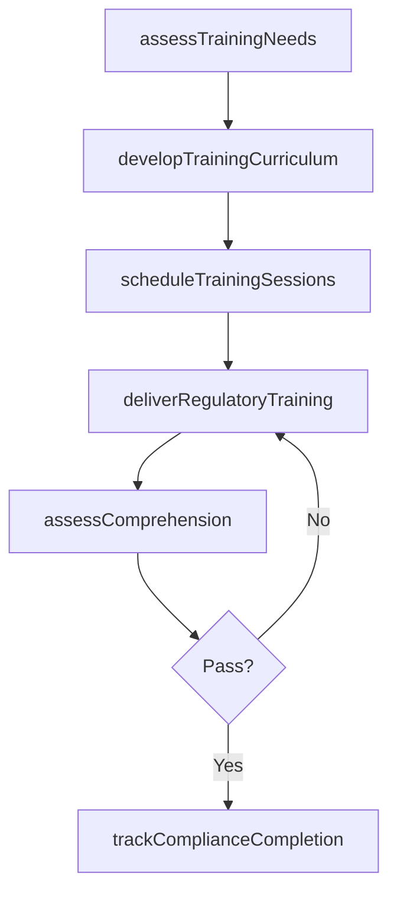

# Train employees on appropriate regulatory requirements

> Business-as-Code definition for training employees on regulatory requirements. Models training program design, delivery, assessment, and compliance tracking.

## Overview

Conducting training and impart learning to existing and new employees. Training will relate to the most recent/enforced regulations of the business to meet Manage regulatory requirements [12771].

## Process Hierarchy



## GraphDL

```yaml
train:
  object: Employees On Appropriate Regulatory Requirements
  actor: TrainingCoordinator
  result: TrainingCompletionRecord
```

## Actions

| Action | Description |
|--------|-------------|
| assessTrainingNeeds | Identify regulatory knowledge gaps across departments and roles |
| developTrainingCurriculum | Create training materials covering applicable regulations |
| scheduleTrainingSessions | Plan and assign training sessions to relevant employees |
| deliverRegulatoryTraining | Conduct training through courses, workshops, or e-learning |
| assessComprehension | Test employee understanding through assessments and certifications |
| trackComplianceCompletion | Monitor and report training completion rates |

## Events

| Event | Description |
|-------|-------------|
| trainingNeedsAssessed | Regulatory knowledge gaps identified by role and department |
| curriculumDeveloped | Training materials created and approved |
| trainingSessionsScheduled | Training calendar published and employees assigned |
| trainingDelivered | Training sessions conducted |
| comprehensionAssessed | Employee assessments scored and recorded |
| complianceCompletionTracked | Training completion rates updated and reported |

## Searches

| Search | Description |
|--------|-------------|
| getTrainingStatus | Retrieve training completion status by employee or department |
| getTrainingCurriculum | Access training materials and course outlines |
| getAssessmentResults | Retrieve employee comprehension assessment scores |

## Process Flow



## RACI Matrix

| Activity | Responsible | Accountable | Consulted | Informed |
|----------|-------------|-------------|-----------|----------|
| assessTrainingNeeds | TrainingCoordinator | RegulatoryAffairsManager | HR, Legal | Department Heads |
| developTrainingCurriculum | TrainingCoordinator | RegulatoryAffairsManager | SubjectMatterExperts | Quality |
| trackComplianceCompletion | TrainingCoordinator | RegulatoryAffairsManager | HR | Executive |

## Related Processes

| Process | Relationship |
|---------|-------------|
| 2.1.3.5.2 Maintain records for regulatory agencies | Related - training records are part of regulatory documentation |
| 2.1.3.5.3 Manage regulatory submission life cycle | Related - trained staff support submission processes |
| 7.3.3 Develop and manage employee training | Related - regulatory training is part of overall training program |

## Related Departments

| Department | Role |
|-----------|------|
| Regulatory Affairs | Provides regulatory subject matter expertise |
| Human Resources | Coordinates training logistics and records |
| Quality Assurance | Supports training content development |

## Related Occupations

| Occupation | Involvement |
|-----------|-------------|
| Training Coordinator | Leads training program design and delivery |
| Regulatory Affairs Specialist | Provides subject matter expertise |
| HR Training Manager | Supports logistics and completion tracking |

## KPIs

| KPI | Description | Unit |
|-----|-------------|------|
| Training Completion Rate | Percentage of required employees completing regulatory training | % |
| Assessment Pass Rate | Percentage of employees passing comprehension assessments | % |
| Training Currency | Percentage of employees with training current within required period | % |

## Usage

```typescript
import { trainEmployeesOnAppropriateRegulatoryRequirements } from '@headlessly/train-employees-on-appropriate-regulatory-requirements'

const trainer = trainEmployeesOnAppropriateRegulatoryRequirements()

// Assess training needs across the organization
const needs = await trainer.assessTrainingNeeds({
  departments: ['Engineering', 'Manufacturing', 'Quality'],
  regulations: ['FDA-21CFR', 'ISO-13485', 'EU-MDR']
})

// Track compliance completion
const status = await trainer.trackComplianceCompletion({
  period: 'Q1-2025',
  department: 'Engineering'
})
```
