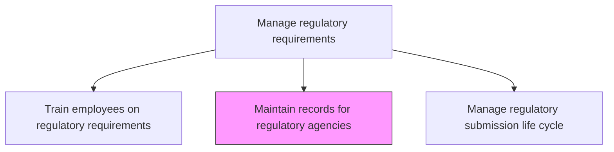
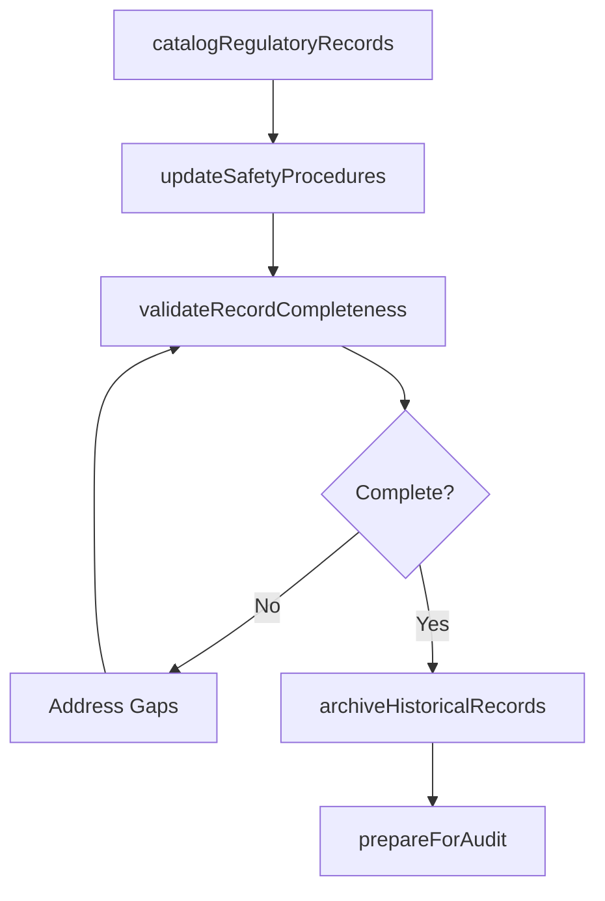

# Maintain records for regulatory agencies

> Business-as-Code definition for maintaining records for regulatory agencies. Models record management, audit preparation, and regulatory documentation governance.

## Overview

Identifying steps and procedures to manage and regularly update the records for regulatory agencies. Updates will be made to safety procedures, identity and access management, software tools and applications, internal accessibility policies, internal quality parameters, etc.

## Process Hierarchy



## GraphDL

```yaml
maintain:
  object: Records For Regulatory Agencies
  actor: RegulatoryRecordsSpecialist
  result: RegulatoryRecordSet
```

## Actions

| Action | Description |
|--------|-------------|
| catalogRegulatoryRecords | Inventory all records required by each regulatory agency |
| updateSafetyProcedures | Refresh safety documentation to reflect current practices |
| validateRecordCompleteness | Verify all required records are present and current |
| archiveHistoricalRecords | Store expired records per retention policy requirements |
| prepareForAudit | Organize records for upcoming regulatory inspections |

## Events

| Event | Description |
|-------|-------------|
| regulatoryRecordsCataloged | Record inventory updated with all required documents |
| safetyProceduresUpdated | Safety documentation refreshed |
| recordCompletenessValidated | All required records verified as present and current |
| historicalRecordsArchived | Expired records stored per retention policies |
| auditPreparationCompleted | Records organized for regulatory inspection |

## Searches

| Search | Description |
|--------|-------------|
| getRegulatoryRecords | Retrieve records by agency, type, or compliance area |
| getRecordGaps | Identify missing or outdated regulatory records |
| getAuditReadiness | Access audit preparation status and outstanding items |

## Process Flow



## RACI Matrix

| Activity | Responsible | Accountable | Consulted | Informed |
|----------|-------------|-------------|-----------|----------|
| catalogRegulatoryRecords | RegulatoryRecordsSpecialist | RegulatoryAffairsManager | Quality | Legal |
| validateRecordCompleteness | RegulatoryRecordsSpecialist | RegulatoryAffairsManager | IT | Compliance |
| prepareForAudit | RegulatoryRecordsSpecialist | RegulatoryAffairsManager | AllDepartments | Executive |

## Related Processes

| Process | Relationship |
|---------|-------------|
| 2.1.3.5.1 Train employees on appropriate regulatory requirements | Related - training records are part of regulatory documentation |
| 2.1.3.5.3 Manage regulatory submission life cycle | Related - submission records must be maintained |
| 2.1.4 Manage product and service master data | Related - regulatory records are a master data category |

## Related Departments

| Department | Role |
|-----------|------|
| Regulatory Affairs | Leads record maintenance and audit preparation |
| Quality Assurance | Provides quality-related regulatory records |
| IT | Maintains record management systems and access controls |

## Related Occupations

| Occupation | Involvement |
|-----------|-------------|
| Regulatory Records Specialist | Manages day-to-day record maintenance |
| Compliance Analyst | Validates record completeness |
| Document Control Specialist | Manages record archival and retrieval |

## KPIs

| KPI | Description | Unit |
|-----|-------------|------|
| Record Completeness | Percentage of required records present and current | % |
| Audit Readiness Score | Assessment of readiness for regulatory inspection | Score (0-100) |
| Record Update Frequency | Average interval between record reviews and updates | Days |

## Usage

```typescript
import { maintainRecordsForRegulatoryAgencies } from '@headlessly/maintain-records-for-regulatory-agencies'

const recordsManager = maintainRecordsForRegulatoryAgencies()

// Validate record completeness for an agency
const validation = await recordsManager.validateRecordCompleteness({
  agency: 'FDA',
  productLine: 'medical-devices',
  recordTypes: ['designHistory', 'riskManagement', 'clinicalData']
})

// Prepare for upcoming audit
const auditPrep = await recordsManager.prepareForAudit({
  agency: 'FDA',
  auditDate: '2025-06-15',
  scope: 'annual-inspection'
})
```
