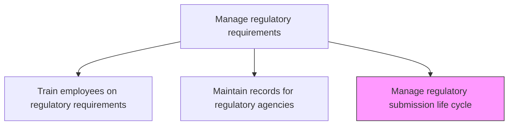
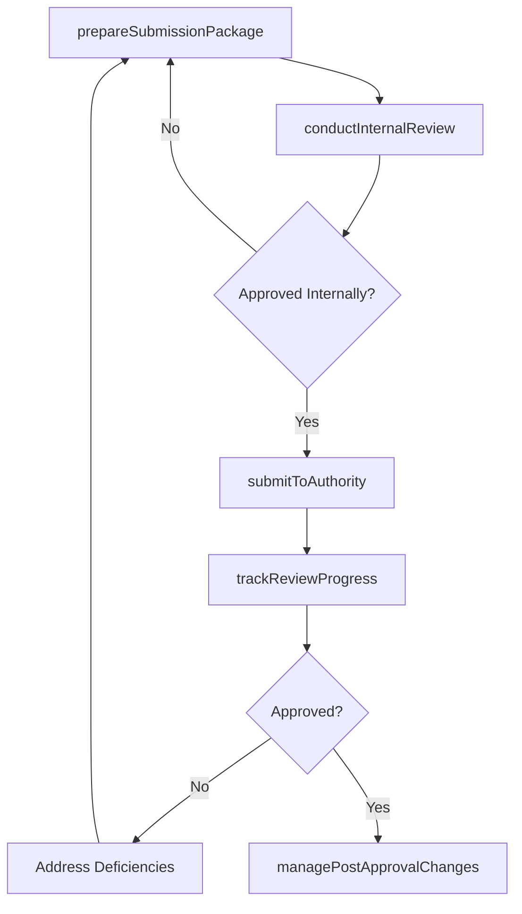

# Manage regulatory submission life cycle

> Business-as-Code definition for managing the regulatory submission lifecycle. Models submission preparation, review orchestration, approval tracking, and post-approval maintenance.

## Overview

Determine and follow the timely input and update of regulatory information by assessing reforms, regulatory policies, and guidelines.

## Process Hierarchy



## GraphDL

```yaml
manage:
  object: Regulatory Submission Life Cycle
  actor: RegulatorySubmissionManager
  result: SubmissionLifecycleRecord
```

## Actions

| Action | Description |
|--------|-------------|
| prepareSubmissionPackage | Assemble all required documentation and data for regulatory filing |
| conductInternalReview | Route submission through internal reviewers for quality and accuracy |
| submitToAuthority | File the completed submission with the regulatory agency |
| trackReviewProgress | Monitor agency review milestones and respond to information requests |
| managePostApprovalChanges | Process supplements, amendments, and renewals after initial approval |

## Events

| Event | Description |
|-------|-------------|
| submissionPackagePrepared | Regulatory filing documentation assembled |
| internalReviewConducted | Internal quality review of submission completed |
| submissionFiled | Regulatory submission submitted to authority |
| reviewProgressTracked | Agency review status updated |
| postApprovalChangeManaged | Post-approval modification processed |

## Searches

| Search | Description |
|--------|-------------|
| getSubmissionStatus | Retrieve current status of regulatory submissions |
| getSubmissionTimeline | Access submission milestones and deadlines |
| getPostApprovalChanges | List post-approval modifications and their status |

## Process Flow



## RACI Matrix

| Activity | Responsible | Accountable | Consulted | Informed |
|----------|-------------|-------------|-----------|----------|
| prepareSubmissionPackage | RegulatorySubmissionManager | RegulatoryAffairsManager | Quality, Engineering | Product |
| conductInternalReview | RegulatorySubmissionManager | RegulatoryAffairsManager | Legal, Medical | Executive |
| submitToAuthority | RegulatorySubmissionManager | GeneralCounsel | RegulatoryAffairs | Board |

## Related Processes

| Process | Relationship |
|---------|-------------|
| 2.1.3.5.2 Maintain records for regulatory agencies | Related - submission records must be maintained |
| 2.1.3.5.1 Train employees on appropriate regulatory requirements | Related - trained staff prepare and review submissions |
| 2.3.2.5 Conduct legal/regulatory/medical review | Related - regulatory reviews feed submission content |

## Related Departments

| Department | Role |
|-----------|------|
| Regulatory Affairs | Leads submission preparation and agency interaction |
| Legal | Reviews submission for legal compliance |
| Quality Assurance | Validates data quality in submission packages |

## Related Occupations

| Occupation | Involvement |
|-----------|-------------|
| Regulatory Submission Manager | Leads submission lifecycle management |
| Regulatory Writer | Prepares submission documentation |
| Quality Assurance Specialist | Validates submission data accuracy |

## KPIs

| KPI | Description | Unit |
|-----|-------------|------|
| Submission Cycle Time | Duration from preparation start to agency filing | Days |
| First-Pass Approval Rate | Percentage of submissions approved without deficiency letters | % |
| Agency Response Time | Average time to respond to agency information requests | Days |

## Usage

```typescript
import { manageRegulatorySubmissionLifeCycle } from '@headlessly/manage-regulatory-submission-life-cycle'

const submissionManager = manageRegulatorySubmissionLifeCycle()

// Prepare a submission package
const submission = await submissionManager.prepareSubmissionPackage({
  productId: 'prod-2025-a',
  submissionType: '510k',
  regulatoryBody: 'FDA',
  targetFilingDate: '2025-04-15'
})

// Track review progress after filing
const progress = await submissionManager.trackReviewProgress({
  submissionId: submission.id,
  checkFrequency: 'weekly'
})
```
