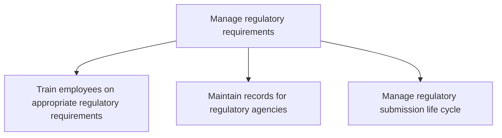
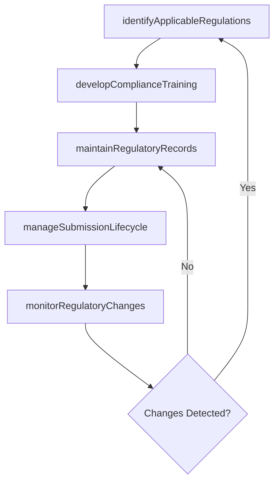

# Manage regulatory requirements

> Business-as-Code definition for managing regulatory requirements in product development. Models regulatory training, record-keeping, and submission lifecycle management.

## Overview

Aligning regulatory activities related to managing industry requirements. Train employees on regulatory requirements. Records for the appropriate regulatory agencies must be maintained and the new product process must be approved by the appropriate regulatory body before it is published to the organization. The submission lifecycle - i.e. creation, review, and approval of the submission and its components must be managed in a collaborative fashion.

## Process Hierarchy



## GraphDL

```yaml
manage:
  object: Regulatory Requirements
  actor: RegulatoryAffairsManager
  result: RegulatoryComplianceRecord
```

## Actions

| Action | Description |
|--------|-------------|
| identifyApplicableRegulations | Determine which regulations apply to each product and market |
| developComplianceTraining | Create training programs for regulatory awareness and adherence |
| maintainRegulatoryRecords | Keep regulatory documentation current and audit-ready |
| manageSubmissionLifecycle | Oversee creation, review, and approval of regulatory submissions |
| monitorRegulatoryChanges | Track regulatory updates that affect product compliance |

## Events

| Event | Description |
|-------|-------------|
| regulationsIdentified | Applicable regulations mapped to products and markets |
| complianceTrainingDeveloped | Regulatory training program created and scheduled |
| regulatoryRecordsMaintained | Regulatory documentation updated and validated |
| submissionLifecycleManaged | Regulatory submission processed through review and approval |
| regulatoryChangesMonitored | Regulatory updates identified and impact assessed |

## Searches

| Search | Description |
|--------|-------------|
| getApplicableRegulations | Retrieve regulations by product, market, or jurisdiction |
| getSubmissionStatus | Access regulatory submission progress and status |
| getTrainingCompletion | Retrieve employee regulatory training completion rates |

## Process Flow



## RACI Matrix

| Activity | Responsible | Accountable | Consulted | Informed |
|----------|-------------|-------------|-----------|----------|
| identifyApplicableRegulations | RegulatoryAffairsManager | GeneralCounsel | Product, Engineering | Executive |
| developComplianceTraining | TrainingCoordinator | RegulatoryAffairsManager | HR, Legal | AllEmployees |
| manageSubmissionLifecycle | RegulatoryAffairsManager | GeneralCounsel | Quality, Product | Operations |

## Sub-Processes

| ID | Name | Description |
|----|------|-------------|
| 2.1.3.5.1 | Train employees on appropriate regulatory requirements | Conducting training and impart learning to existing and new employees. Training will relate to the m |
| 2.1.3.5.2 | Maintain records for regulatory agencies | Identifying steps and procedures to manage and regularly update the records for regulatory agencies. |
| 2.1.3.5.3 | Manage regulatory submission life cycle | Determine and follow the timely input and update of regulatory information by assessing reforms, reg |

## Related Processes

| Process | Relationship |
|---------|-------------|
| 2.1.3.1 Conduct mandatory and elective reviews | Upstream - reviews identify regulatory compliance gaps |
| 2.1.3.4 Define product technical documentation management requirements | Related - regulatory documentation is a core documentation type |
| 2.3.2.5 Conduct legal/regulatory/medical review | Downstream - regulatory requirements inform product review |

## Related Departments

| Department | Role |
|-----------|------|
| Regulatory Affairs | Leads regulatory compliance and submission management |
| Legal | Provides legal interpretation of regulatory requirements |
| Quality Assurance | Ensures products meet regulatory quality standards |
| Human Resources | Coordinates regulatory training programs |

## Related Occupations

| Occupation | Involvement |
|-----------|-------------|
| Regulatory Affairs Manager | Leads regulatory compliance activities |
| Compliance Specialist | Manages records and submission processes |
| Training Coordinator | Develops and delivers regulatory training |

## KPIs

| KPI | Description | Unit |
|-----|-------------|------|
| Regulatory Training Completion | Percentage of employees completing required regulatory training | % |
| Submission Approval Rate | Percentage of regulatory submissions approved on first review | % |
| Record Audit Readiness | Percentage of regulatory records passing audit readiness checks | % |
| Regulatory Change Response Time | Time from regulatory change publication to compliance update | Days |

## Usage

```typescript
import { manageRegulatoryRequirements } from '@headlessly/manage-regulatory-requirements'

const regManager = manageRegulatoryRequirements()

// Identify applicable regulations for a product
const regulations = await regManager.identifyApplicableRegulations({
  productId: 'prod-2025-a',
  markets: ['US', 'EU'],
  categories: ['safety', 'environmental', 'dataPrivacy']
})

// Manage a regulatory submission
const submission = await regManager.manageSubmissionLifecycle({
  submissionType: 'pre-market-notification',
  regulatoryBody: 'FDA',
  productId: 'prod-2025-a'
})
```
