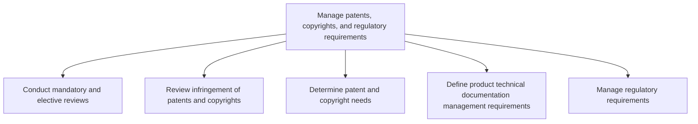
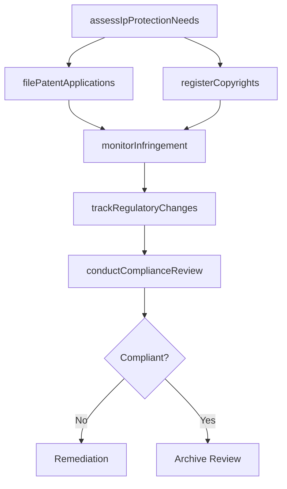

# Manage patents, copyrights, and regulatory requirements

> Business-as-Code definition for managing intellectual property protections and regulatory compliance. Models patent portfolio governance, copyright administration, and regulatory alignment for product development.

## Overview

Determining the attributes necessary to protect and safeguard intellectual assets, maximize the value of IP assets through streamlined process, and collaboration between departments. Focus on needs to safeguard, critical assets, and assets' value.

## Process Hierarchy



## GraphDL

```yaml
manage:
  object: Patents, Copyrights, And Regulatory Requirements
  actor: IpAndRegulatoryManager
  result: IpRegulatoryComplianceRecord
```

## Actions

| Action | Description |
|--------|-------------|
| assessIpProtectionNeeds | Evaluate which inventions and works require IP protection |
| filePatentApplications | Prepare and submit patent applications for novel inventions |
| registerCopyrights | Register copyright protections for original works |
| monitorInfringement | Scan for potential IP infringement by third parties |
| trackRegulatoryChanges | Monitor regulatory environment for changes affecting products |
| conductComplianceReview | Perform periodic reviews of regulatory compliance status |

## Events

| Event | Description |
|-------|-------------|
| ipProtectionNeedsAssessed | IP protection requirements evaluated for portfolio |
| patentApplicationFiled | Patent application submitted to relevant authority |
| copyrightRegistered | Copyright protection formally registered |
| infringementDetected | Potential IP infringement identified |
| regulatoryChangeTracked | Regulatory change identified and impact assessed |
| complianceReviewCompleted | Periodic compliance review finalized |

## Searches

| Search | Description |
|--------|-------------|
| getPatentPortfolio | Retrieve patent applications and grants by product or technology |
| getCopyrightRegistry | Access registered copyrights and their status |
| getInfringementCases | List active infringement monitoring cases |
| getRegulatoryRequirements | Retrieve applicable regulatory requirements by jurisdiction |

## Process Flow



## RACI Matrix

| Activity | Responsible | Accountable | Consulted | Informed |
|----------|-------------|-------------|-----------|----------|
| assessIpProtectionNeeds | IpCounsel | GeneralCounsel | Engineering, Product | Executive |
| filePatentApplications | PatentAttorney | GeneralCounsel | Inventors | Product |
| trackRegulatoryChanges | RegulatoryManager | VP Legal | Product, Quality | Operations |
| conductComplianceReview | ComplianceOfficer | GeneralCounsel | AllDepartments | Board |

## Sub-Processes

| ID | Name | Description |
|----|------|-------------|
| 2.1.3.1 | Conduct mandatory and elective reviews | Conducting necessary performance reviews on enforcement of processes and steps to ensure protection. |
| 2.1.3.2 | Review infringement of patents and copyrights | Reviewing activities in regards to patentability and infringement. The usage of Open Source in comme |
| 2.1.3.3 | Determine patent and copyright needs | Determining the business need for patents and copyrights. The patents and copyrights are managed by  |
| 2.1.3.4 | Define product technical documentation management requirements | Defining sourcing and procurement requirements for new product technical documentation management. M |
| 2.1.3.5 | Manage regulatory requirements | Aligning regulatory activities related to managing industry requirements. Train employees on regulat |

## Related Processes

| Process | Relationship |
|---------|-------------|
| 2.1.1 Manage product and service portfolio | Upstream - portfolio decisions drive IP protection needs |
| 2.3.1 Design and prototype products and services | Related - design outputs generate patentable inventions |
| 6.5.3 Manage copyrights and patents | Related - enterprise-level IP management |

## Related Departments

| Department | Role |
|-----------|------|
| Legal | Leads IP protection and regulatory compliance |
| Engineering | Identifies patentable inventions and technical innovations |
| Regulatory Affairs | Manages regulatory submissions and compliance monitoring |
| Product Management | Identifies IP and regulatory needs for product concepts |

## Related Occupations

| Occupation | Involvement |
|-----------|-------------|
| Patent Attorney | Files and manages patent applications |
| Regulatory Affairs Manager | Oversees regulatory compliance and submissions |
| IP Counsel | Advises on intellectual property strategy |

## KPIs

| KPI | Description | Unit |
|-----|-------------|------|
| Patent Filing Rate | Number of patent applications filed per year | Applications/Year |
| IP Protection Coverage | Percentage of key innovations with IP protection | % |
| Regulatory Compliance Rate | Percentage of products meeting all regulatory requirements | % |
| Infringement Resolution Time | Average time to resolve detected infringement cases | Days |

## Usage

```typescript
import { managePatentsCopyrightsAndRegulatoryRequirements } from '@headlessly/manage-patents-copyrights-and-regulatory-requirements'

const ipManager = managePatentsCopyrightsAndRegulatoryRequirements()

// Assess IP protection needs for new product concepts
const needs = await ipManager.assessIpProtectionNeeds({
  productIds: ['prod-2025-a', 'prod-2025-b'],
  jurisdictions: ['US', 'EU', 'JP']
})

// Monitor for potential infringement
const alerts = await ipManager.monitorInfringement({
  patentIds: ['pat-001', 'pat-002'],
  scanFrequency: 'weekly'
})
```
