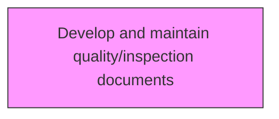
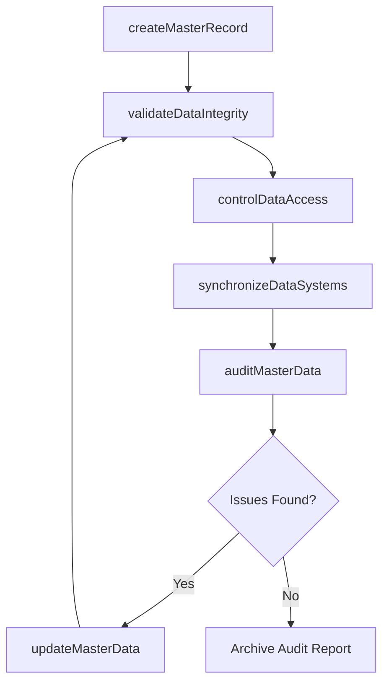

# Develop and maintain quality/inspection documents

> Business-as-Code definition for develop and maintain quality/inspection documents. Models managing product and service master data governance, storage, and access control.

## Overview

Determining procedures required to assess the sustainability of defined criterion for product/service delivery to customers. Retain results for further review as a procedural practice.

## Process Hierarchy



## GraphDL

```yaml
develop:
  object: And Maintain Quality/inspection Documents
  actor: MasterDataManager
  result: MasterDataRecord
```

## Actions

| Action | Description |
|--------|-------------|
| createMasterRecord | Create a new master data entry with validated attributes |
| updateMasterData | Modify existing master data records through controlled change process |
| validateDataIntegrity | Verify accuracy and consistency of master data across systems |
| controlDataAccess | Manage permissions and access rights to master data |
| synchronizeDataSystems | Ensure master data consistency across integrated applications |
| auditMasterData | Review master data quality and compliance with governance policies |

## Events

| Event | Description |
|-------|-------------|
| masterRecordCreated | New master data entry created and validated |
| masterDataUpdated | Existing master data record modified through change control |
| dataIntegrityValidated | Master data accuracy and consistency verified |
| dataAccessControlled | Access permissions updated for master data records |
| dataSystemsSynchronized | Cross-system data consistency confirmed |
| masterDataAudited | Master data quality and compliance audit completed |

## Searches

| Search | Description |
|--------|-------------|
| getMasterRecords | Retrieve master data records by type, product, or classification |
| getDataQualityMetrics | Access data quality scores and integrity check results |
| getAccessPermissions | Retrieve data access rights by user or role |
| getDataChangeHistory | Access audit trail of master data modifications |

## Process Flow



## RACI Matrix

| Activity | Responsible | Accountable | Consulted | Informed |
|----------|-------------|-------------|-----------|----------|
| createMasterRecord | MasterDataAnalyst | MasterDataManager | Engineering, Product | Operations |
| validateDataIntegrity | DataQualityAnalyst | MasterDataManager | IT | AllDepartments |
| controlDataAccess | DataGovernanceOfficer | VP Engineering | IT, Security | Compliance |
| auditMasterData | MasterDataManager | VP Engineering | Quality, IT | Executive |

## Related Processes

| Process | Relationship |
|---------|-------------|
| 2.1.3.4 Define product technical documentation management requirements | Upstream - documentation requirements inform master data structure |
| 2.3.1.8 Design products/services | Downstream - design outputs generate master data records |
| 2.1.4 Manage product and service master data (sibling activities) | Parallel - sibling activities share governance framework |

## Related Departments

| Department | Role |
|-----------|------|
| Data Management | Primary owner of master data governance and quality |
| Engineering | Creates and consumes technical product master data |
| IT | Maintains master data management systems and integrations |
| Quality Assurance | Validates data quality and compliance |

## Related Occupations

| Occupation | Involvement |
|-----------|-------------|
| Master Data Analyst | Creates and maintains master data records |
| Data Quality Analyst | Validates data integrity and consistency |
| Data Governance Officer | Oversees access control and governance policies |

## KPIs

| KPI | Description | Unit |
|-----|-------------|------|
| Data Accuracy Rate | Percentage of master data records passing quality validation | % |
| Data Completeness | Percentage of required fields populated across master records | % |
| Synchronization Lag | Average time for data changes to propagate across systems | Minutes |
| Access Request Resolution Time | Average time to process data access requests | Hours |

## Usage

```typescript
import { developAndMaintainQualityinspectionDocuments } from '@headlessly/develop-and-maintain-qualityinspection-documents'

const client = developAndMaintainQualityinspectionDocuments()

// Create a new master data entry with validated attributes
const result = await client.createMasterRecord({
  productId: 'prod-2025-a'
})

// Modify existing master data records through controlled change process
const result2 = await client.updateMasterData({
  productId: 'prod-2025-a'
})
```
