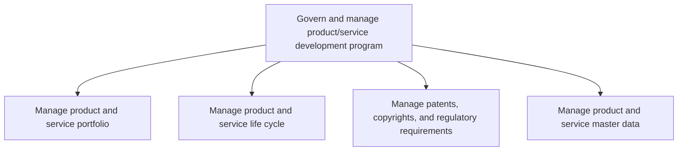
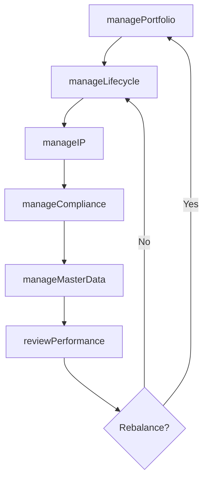

# Govern and manage product/service development program

> Business-as-Code definition for product and service development program governance. Models the management of product portfolios, lifecycle stages, intellectual property, regulatory compliance, and master data throughout the development program.

## Overview

Supervising the complete product/service program from innovation until its commercial success. Meeting the customer demand and expectations. Conduct further development and innovation pertaining to business goals.

## Process Hierarchy



## GraphDL

```yaml
govern:
  object: And Manage Product/service Development Program
  actor: VP ProductDevelopment
  result: ProductProgramStatus
```

## Actions

| Action | Description |
|--------|-------------|
| managePortfolio | Evaluate, prioritize, and balance the product and service portfolio |
| manageLifecycle | Guide products through introduction, growth, maturity, and retirement |
| manageIP | Oversee patent filings, copyright protections, and IP strategy |
| manageCompliance | Ensure products meet regulatory and industry standard requirements |
| manageMasterData | Maintain authoritative product data, BOMs, and specifications |
| reviewPerformance | Assess product portfolio performance against targets |

## Events

| Event | Description |
|-------|-------------|
| portfolioManaged | Product portfolio reviewed and rebalanced |
| lifecycleUpdated | Product lifecycle stage transition recorded |
| ipManaged | Patent or copyright filing submitted or updated |
| complianceVerified | Regulatory compliance review completed |
| masterDataUpdated | Product master data records updated and validated |
| performanceReviewed | Portfolio performance assessment completed |

## Searches

| Search | Description |
|--------|-------------|
| getPortfolioStatus | Retrieve current portfolio composition and performance metrics |
| getLifecycleStage | Access the lifecycle stage and history for a specific product |
| getIPAssets | List intellectual property assets by type, status, or product |
| getComplianceStatus | Retrieve regulatory compliance status for products |
| getMasterData | Access product master data records and specifications |

## Process Flow



## RACI Matrix

| Activity | Responsible | Accountable | Consulted | Informed |
|----------|-------------|-------------|-----------|----------|
| managePortfolio | ProductManager | VP ProductDevelopment | Marketing, Finance | Executive |
| manageLifecycle | ProductManager | VP ProductDevelopment | Sales, Operations | Marketing |
| manageIP | IPCounsel | GeneralCounsel | R&D, Engineering | VP ProductDevelopment |
| manageCompliance | RegulatoryAffairs | VP ProductDevelopment | Legal, QA | Operations |
| manageMasterData | DataSteward | VP ProductDevelopment | Engineering, QA | Supply Chain |

## Sub-Processes

| ID | Name | Description |
|----|------|-------------|
| 2.1.1 | Manage product and service portfolio | Managing a portfolio of product/service offerings to take advantage of shifts in the market expectat |
| 2.1.2 | Manage product and service life cycle | Manage the introduction and withdrawal of products/services. Administer associated changes, namely m |
| 2.1.3 | Manage patents, copyrights, and regulatory requirements | Determining the attributes necessary to protect and safeguard intellectual assets, maximize the valu |
| 2.1.4 | Manage product and service master data | Controlling/authorizing to enable services' and products' data and other critical data of these func |

## Related Processes

| Process | Relationship |
|---------|-------------|
| 2.2 Generate and define new product/service ideas | Upstream - new ideas feed the portfolio pipeline |
| 2.3 Develop products and services | Downstream - portfolio decisions trigger product development |
| 1.0 Develop Vision and Strategy | Upstream - strategic priorities guide portfolio investment |
| 4.0 Deliver Products and Services | Downstream - lifecycle management connects to delivery |

## Related Departments

| Department | Role |
|-----------|------|
| Product Development | Owns portfolio governance and lifecycle management |
| Legal | Manages patents, copyrights, and IP protection |
| Regulatory Affairs | Ensures compliance with industry and government regulations |
| Engineering | Maintains product specifications and master data |
| Quality Assurance | Validates product quality throughout the lifecycle |

## Related Occupations

| Occupation | Involvement |
|-----------|-------------|
| Product Manager | Manages portfolio prioritization and lifecycle decisions |
| IP Counsel | Handles intellectual property strategy and filings |
| Regulatory Affairs Specialist | Ensures products meet regulatory standards |
| Data Steward | Maintains product master data integrity |

## KPIs

| KPI | Description | Unit |
|-----|-------------|------|
| Portfolio Health Score | Balanced scorecard of portfolio diversity, growth, and profitability | Score (1-10) |
| Product Lifecycle Velocity | Average time from introduction to maturity stage | Months |
| IP Filing Rate | Number of patent and copyright filings per year | Count |
| Master Data Accuracy | Percentage of product records meeting data quality standards | % |
| Regulatory Compliance Rate | Percentage of products fully compliant with applicable regulations | % |

## Usage

```typescript
import { governAndManageProductServiceDevelopmentProgram } from '@headlessly/govern-and-manage-product-service-development-program'

const program = governAndManageProductServiceDevelopmentProgram()

// Review the portfolio
const portfolio = await program.managePortfolio({
  action: 'review',
  criteria: ['strategic-fit', 'market-performance', 'profitability']
})

// Update lifecycle stage for a product
await program.manageLifecycle({
  productId: 'prod-123',
  newStage: 'maturity',
  reason: 'Market saturation reached'
})

// Check compliance status
const compliance = await program.manageCompliance({
  productId: 'prod-123',
  regulations: ['FDA', 'CE', 'ISO-9001']
})
```
