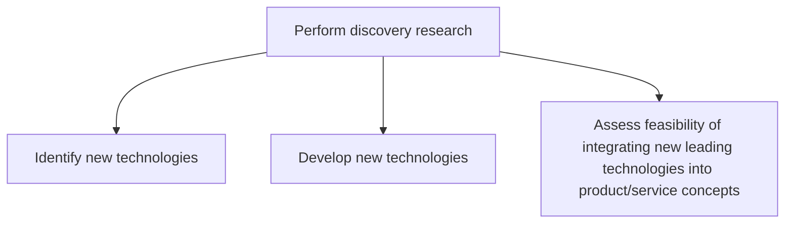
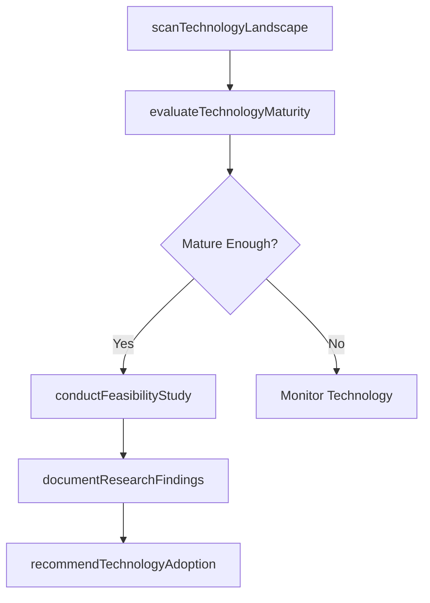

# Perform discovery research

> Business-as-Code definition for perform discovery research. Models performing discovery research to identify emerging technologies and innovation opportunities.

## Overview

Coordinating R&D activity to identify new technologies to integrate into the revamped portfolio of products/services. Conduct early-stage R&D activity to close gaps between existing solution offerings and changing market expectations. Triangulate appropriate technologies that can support the development of a revised product/service portfolio.

## Process Hierarchy



## GraphDL

```yaml
perform:
  object: Discovery Research
  actor: ResearchDirector
  result: DiscoveryResearchReport
```

## Actions

| Action | Description |
|--------|-------------|
| scanTechnologyLandscape | Survey emerging technologies relevant to the product domain |
| evaluateTechnologyMaturity | Assess the readiness level of identified technologies for adoption |
| conductFeasibilityStudy | Analyze technical and commercial feasibility of technology integration |
| documentResearchFindings | Compile discovery research results into actionable reports |
| recommendTechnologyAdoption | Propose specific technologies for product integration |

## Events

| Event | Description |
|-------|-------------|
| technologyLandscapeScanned | Technology landscape survey completed |
| technologyMaturityEvaluated | Technology readiness assessment finalized |
| feasibilityStudyConducted | Technical and commercial feasibility analysis completed |
| researchFindingsDocumented | Discovery research report compiled |
| technologyAdoptionRecommended | Technology adoption proposals submitted |

## Searches

| Search | Description |
|--------|-------------|
| getTechnologyScan | Retrieve technology landscape scan results |
| getFeasibilityStudies | Access feasibility study results by technology |
| getResearchReports | Retrieve discovery research reports by topic or period |

## Process Flow



## RACI Matrix

| Activity | Responsible | Accountable | Consulted | Informed |
|----------|-------------|-------------|-----------|----------|
| scanTechnologyLandscape | ResearchScientist | ResearchDirector | Engineering, Product | Strategy |
| evaluateTechnologyMaturity | ResearchScientist | ResearchDirector | Engineering | Product |
| conductFeasibilityStudy | ResearchEngineer | ResearchDirector | Finance, Product | Executive |
| recommendTechnologyAdoption | ResearchDirector | CTO | Product, Strategy | Board |

## Sub-Processes

| ID | Name | Description |
|----|------|-------------|
| 2.2.1.1 | Identify new technologies | Determining new technologies to revise the portfolio of solution offerings. Identify recently develo |
| 2.2.1.2 | Develop new technologies | Developing new technologies from scratch to integrate into a revised portfolio of solutions. Develop |
| 2.2.1.3 | Assess feasibility of integrating new leading technologies into product/service concepts | Appraising the feasibility of integrating new technologies, whether developed as a custom solution o |

## Related Processes

| Process | Relationship |
|---------|-------------|
| 2.2.2 Generate new product/service concepts | Downstream - research findings inspire new concepts |
| 2.2.3 Define product/service development requirements | Downstream - technology options inform requirements |
| 1.1.1.1 Identify competitors | Related - competitive technology landscape informs research |

## Related Departments

| Department | Role |
|-----------|------|
| R&D | Leads discovery research and technology evaluation |
| Engineering | Assesses technical feasibility of new technologies |
| Product Management | Defines product domains for technology scouting |
| Strategy | Aligns research with strategic innovation priorities |

## Related Occupations

| Occupation | Involvement |
|-----------|-------------|
| Research Scientist | Conducts technology landscape analysis |
| Research Engineer | Performs feasibility studies |
| Technology Scout | Identifies emerging technologies |

## KPIs

| KPI | Description | Unit |
|-----|-------------|------|
| Technology Scan Coverage | Number of technology domains actively monitored | Domains |
| Feasibility Study Completion Rate | Percentage of identified technologies receiving feasibility assessment | % |
| Research-to-Concept Rate | Percentage of research findings leading to new product concepts | % |
| Time to Technology Assessment | Average time from technology identification to readiness assessment | Weeks |

## Usage

```typescript
import { performDiscoveryResearch } from '@headlessly/perform-discovery-research'

const client = performDiscoveryResearch()

// Survey emerging technologies relevant to the product domain
const result = await client.scanTechnologyLandscape({
  productId: 'prod-2025-a'
})

// Assess the readiness level of identified technologies for adoption
const result2 = await client.evaluateTechnologyMaturity({
  productId: 'prod-2025-a'
})
```
