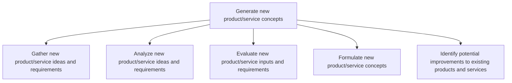
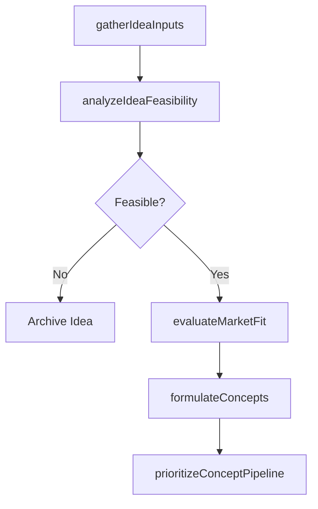

# Generate new product/service concepts

> Business-as-Code definition for generate new product/service concepts. Models generating and evaluating new product and service concepts through ideation and requirements analysis.

## Overview

Producing and defining ideologies for new product/service offerings.

## Process Hierarchy



## GraphDL

```yaml
generate:
  object: New Product/service Concepts
  actor: InnovationManager
  result: ProductServiceConcept
```

## Actions

| Action | Description |
|--------|-------------|
| gatherIdeaInputs | Collect product/service ideas from customers, employees, and market research |
| analyzeIdeaFeasibility | Assess technical, commercial, and operational viability of ideas |
| evaluateMarketFit | Determine alignment between ideas and target market needs |
| formulateConcepts | Transform validated ideas into defined product/service concepts |
| prioritizeConceptPipeline | Rank concepts by strategic value, feasibility, and market potential |

## Events

| Event | Description |
|-------|-------------|
| ideaInputsGathered | Product/service ideas collected from all sources |
| ideaFeasibilityAnalyzed | Idea viability assessment completed |
| marketFitEvaluated | Market alignment analysis finalized |
| conceptsFormulated | Ideas transformed into defined concepts |
| conceptPipelinePrioritized | Concept rankings established |

## Searches

| Search | Description |
|--------|-------------|
| getIdeaPipeline | Retrieve submitted ideas filtered by source, status, or domain |
| getConceptEvaluations | Access concept feasibility and market fit assessments |
| getConceptRankings | Retrieve prioritized concept list with scores |

## Process Flow



## RACI Matrix

| Activity | Responsible | Accountable | Consulted | Informed |
|----------|-------------|-------------|-----------|----------|
| gatherIdeaInputs | InnovationManager | VP Product | Sales, Marketing, Engineering | AllDepartments |
| analyzeIdeaFeasibility | ProductAnalyst | VP Product | Engineering, Finance | Strategy |
| formulateConcepts | InnovationManager | VP Product | Engineering, Marketing | Executive |
| prioritizeConceptPipeline | InnovationManager | CPO | Strategy, Finance | Board |

## Sub-Processes

| ID | Name | Description |
|----|------|-------------|
| 2.2.2.1 | Gather new product/service ideas and requirements | Collecting necessary items, documents, regulatory requirements, etc., based on Generate and define n |
| 2.2.2.2 | Analyze new product/service ideas and requirements | Assessing and reviewing the concepts and requirements of Generate and define new product/service ide |
| 2.2.2.3 | Evaluate new product/service inputs and requirements | Assessing and reviewing the required inputs and necessary elements such as automation, technology, h |
| 2.2.2.4 | Formulate new product/service concepts | Devising ideas and elements necessary for thoughts on new product/service development. |
| 2.2.2.5 | Identify potential improvements to existing products and services | Defining potential enhancements to current products/services in order to take advantage of a shift i |

## Related Processes

| Process | Relationship |
|---------|-------------|
| 2.2.1 Perform discovery research | Upstream - research findings inspire new concepts |
| 2.2.3 Define product/service development requirements | Downstream - concepts drive requirements definition |
| 2.1.1.3 Prioritize and select new product/service concepts | Downstream - generated concepts enter selection process |

## Related Departments

| Department | Role |
|-----------|------|
| Product Management | Leads concept generation and evaluation |
| R&D | Provides technical feasibility input |
| Marketing | Contributes market intelligence and customer insights |
| Sales | Provides customer feedback and competitive intelligence |

## Related Occupations

| Occupation | Involvement |
|-----------|-------------|
| Innovation Manager | Leads ideation and concept formulation |
| Product Analyst | Evaluates concept feasibility and market fit |
| Market Researcher | Gathers market data for concept validation |

## KPIs

| KPI | Description | Unit |
|-----|-------------|------|
| Idea Submission Volume | Number of new ideas submitted per period | Ideas/Quarter |
| Concept Conversion Rate | Percentage of ideas advancing to concept stage | % |
| Concept-to-Development Rate | Percentage of concepts approved for development | % |
| Time to Concept | Average time from idea submission to concept formulation | Days |

## Usage

```typescript
import { generateNewProductserviceConcepts } from '@headlessly/generate-new-productservice-concepts'

const client = generateNewProductserviceConcepts()

// Collect product/service ideas from customers, employees, and market research
const result = await client.gatherIdeaInputs({
  productId: 'prod-2025-a'
})

// Assess technical, commercial, and operational viability of ideas
const result2 = await client.analyzeIdeaFeasibility({
  productId: 'prod-2025-a'
})
```
