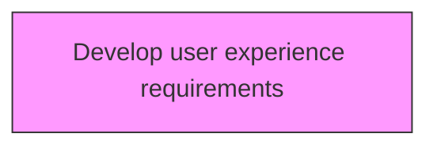
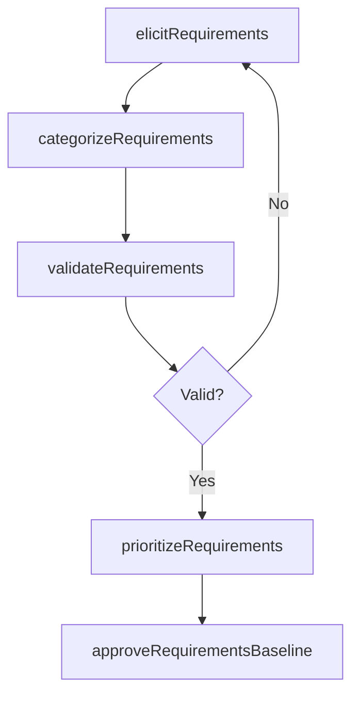

# Develop user experience requirements

> Business-as-Code definition for develop user experience requirements. Models defining product and service development requirements including functional, safety, regulatory, and user experience specifications.

## Overview

Identifying and creating steps and tools to develop the user experience.

## Process Hierarchy



## GraphDL

```yaml
develop:
  object: User Experience Requirements
  actor: RequirementsManager
  result: RequirementsSpecification
```

## Actions

| Action | Description |
|--------|-------------|
| elicitRequirements | Gather requirements from stakeholders, standards, and regulatory sources |
| categorizeRequirements | Organize requirements by type: functional, safety, regulatory, UX |
| validateRequirements | Confirm requirements are complete, consistent, and achievable |
| prioritizeRequirements | Rank requirements by business value and implementation complexity |
| approveRequirementsBaseline | Formally authorize the requirements specification for development |

## Events

| Event | Description |
|-------|-------------|
| requirementsElicited | Requirements gathered from all sources |
| requirementsCategorized | Requirements organized by type and domain |
| requirementsValidated | Requirements completeness and consistency confirmed |
| requirementsPrioritized | Requirements ranked by value and complexity |
| requirementsBaselineApproved | Requirements specification authorized for development |

## Searches

| Search | Description |
|--------|-------------|
| getRequirements | Retrieve requirements by product, type, or priority |
| getRequirementTraceability | Access requirement-to-source and requirement-to-test mappings |
| getRequirementStatus | Retrieve requirements implementation and validation status |

## Process Flow



## RACI Matrix

| Activity | Responsible | Accountable | Consulted | Informed |
|----------|-------------|-------------|-----------|----------|
| elicitRequirements | RequirementsAnalyst | RequirementsManager | Customers, Engineering | Product |
| validateRequirements | RequirementsAnalyst | RequirementsManager | Quality, Regulatory | Engineering |
| prioritizeRequirements | RequirementsManager | VP Product | Strategy, Engineering | Finance |
| approveRequirementsBaseline | RequirementsManager | CPO | Engineering, Quality | AllDepartments |

## Related Processes

| Process | Relationship |
|---------|-------------|
| 2.2.2 Generate new product/service concepts | Upstream - concepts drive requirements definition |
| 2.3.1 Design and prototype products and services | Downstream - requirements guide design activities |
| 2.1.3.5 Manage regulatory requirements | Related - regulatory requirements feed into product requirements |

## Related Departments

| Department | Role |
|-----------|------|
| Product Management | Leads requirements elicitation and prioritization |
| Engineering | Validates technical feasibility of requirements |
| Quality Assurance | Ensures requirements meet quality and regulatory standards |
| UX Design | Defines user experience requirements |

## Related Occupations

| Occupation | Involvement |
|-----------|-------------|
| Requirements Analyst | Elicits, documents, and validates requirements |
| Product Manager | Prioritizes requirements by business value |
| UX Researcher | Defines user experience requirements |

## KPIs

| KPI | Description | Unit |
|-----|-------------|------|
| Requirements Completeness | Percentage of required specification fields populated | % |
| Requirements Stability | Percentage of requirements unchanged after baseline approval | % |
| Stakeholder Coverage | Percentage of identified stakeholders consulted during elicitation | % |
| Requirements Validation Rate | Percentage of requirements passing validation on first review | % |

## Usage

```typescript
import { developUserExperienceRequirements } from '@headlessly/develop-user-experience-requirements'

const client = developUserExperienceRequirements()

// Gather requirements from stakeholders, standards, and regulatory sources
const result = await client.elicitRequirements({
  productId: 'prod-2025-a'
})

// Organize requirements by type: functional, safety, regulatory, UX
const result2 = await client.categorizeRequirements({
  productId: 'prod-2025-a'
})
```
