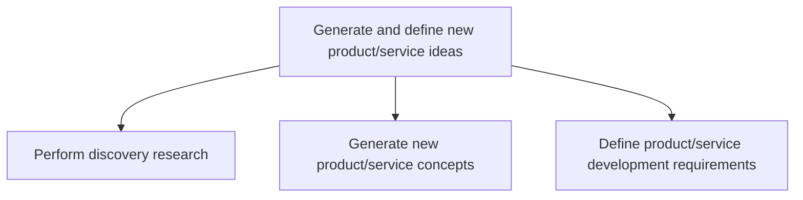
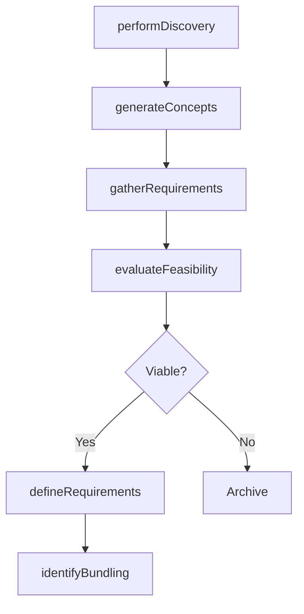

# Generate and define new product/service ideas

> Business-as-Code definition for new product and service ideation. Models the discovery research, concept generation, requirements definition, and feasibility assessment processes that transform market needs into actionable product concepts.

## Overview

Identifying and describing new product or service thoughts based on organizational objectives/targets.

## Process Hierarchy



## GraphDL

```yaml
generate:
  object: And Define New Product/service Ideas
  actor: InnovationManager
  result: ProductConceptBrief
```

## Actions

| Action | Description |
|--------|-------------|
| performDiscovery | Research emerging technologies and market opportunities |
| generateConcepts | Brainstorm and formulate new product or service concepts |
| gatherRequirements | Collect functional, technical, and user experience requirements |
| evaluateFeasibility | Assess technical and commercial viability of proposed concepts |
| defineRequirements | Formalize and document development requirements for approved concepts |
| identifyBundling | Explore product and service bundling opportunities |

## Events

| Event | Description |
|-------|-------------|
| discoveryPerformed | Discovery research phase completed with findings documented |
| conceptsGenerated | New product or service concepts created and cataloged |
| requirementsGathered | Initial requirements collected from stakeholders and market data |
| feasibilityEvaluated | Technical and commercial feasibility assessment completed |
| requirementsDefined | Development requirements formally documented and approved |
| bundlingIdentified | Product and service bundling opportunities evaluated |

## Searches

| Search | Description |
|--------|-------------|
| listConcepts | Retrieve product concepts filtered by stage, category, or sponsor |
| getConceptDetails | Access detailed information for a specific product concept |
| getRequirements | Retrieve development requirements by product concept |
| findTechnologyOpportunities | List emerging technologies evaluated for product integration |

## Process Flow



## RACI Matrix

| Activity | Responsible | Accountable | Consulted | Informed |
|----------|-------------|-------------|-----------|----------|
| performDiscovery | R&DLead | VP ProductDevelopment | CTO, Marketing | Strategy |
| generateConcepts | InnovationManager | VP ProductDevelopment | Sales, CustomerSuccess | Executive |
| gatherRequirements | ProductManager | VP ProductDevelopment | Engineering, UX | Marketing |
| evaluateFeasibility | ProductEngineer | VP ProductDevelopment | Finance, Operations | R&D |
| defineRequirements | ProductManager | VP ProductDevelopment | Engineering, QA | Manufacturing |

## Sub-Processes

| ID | Name | Description |
|----|------|-------------|
| 2.2.1 | Perform discovery research | Coordinating R&D activity to identify new technologies to integrate into the revamped portfolio of p |
| 2.2.2 | Generate new product/service concepts | Producing and defining ideologies for new product/service offerings. |
| 2.2.3 | Define product/service development requirements | Encompassing the identification and capture of new product/service requirements or potential improve |

## Related Processes

| Process | Relationship |
|---------|-------------|
| 2.1 Govern and manage product/service development program | Downstream - approved concepts enter portfolio governance |
| 2.3 Develop products and services | Downstream - defined requirements feed the design and prototyping process |
| 1.1.2 Survey market and determine customer needs and wants | Upstream - market needs inform concept generation |

## Related Departments

| Department | Role |
|-----------|------|
| Product Development | Leads concept generation and requirements definition |
| Research and Development | Conducts discovery research and technology evaluation |
| Marketing | Provides market insights and customer needs data |
| Engineering | Assesses technical feasibility of proposed concepts |
| UX Design | Contributes user experience requirements |

## Related Occupations

| Occupation | Involvement |
|-----------|-------------|
| Innovation Manager | Facilitates ideation and concept generation |
| Product Manager | Defines and documents product requirements |
| R&D Engineer | Evaluates technology integration opportunities |
| UX Researcher | Gathers user experience requirements |

## KPIs

| KPI | Description | Unit |
|-----|-------------|------|
| Idea-to-Concept Conversion | Percentage of raw ideas advanced to formal concept stage | % |
| Concept Approval Rate | Percentage of concepts that pass feasibility evaluation | % |
| Discovery Research Output | Number of actionable technology opportunities identified per quarter | Count |
| Requirements Completeness | Percentage of requirements fully defined before development starts | % |

## Usage

```typescript
import { generateAndDefineNewProductServiceIdeas } from '@headlessly/generate-and-define-new-product-service-ideas'

const ideation = generateAndDefineNewProductServiceIdeas()

// Perform discovery research
const discoveries = await ideation.performDiscovery({
  focus: ['AI', 'IoT', 'edge-computing'],
  sources: ['academic-journals', 'patent-filings', 'tech-conferences']
})

// Generate new product concepts
const concepts = await ideation.generateConcepts({
  discoveryId: discoveries.id,
  method: 'design-thinking',
  targetSegment: 'enterprise'
})

// Define development requirements for approved concept
await ideation.defineRequirements({
  conceptId: concepts[0].id,
  includeUX: true,
  regulatoryScope: ['SOC2', 'GDPR']
})
```
