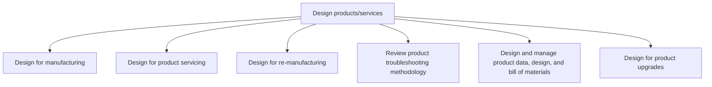
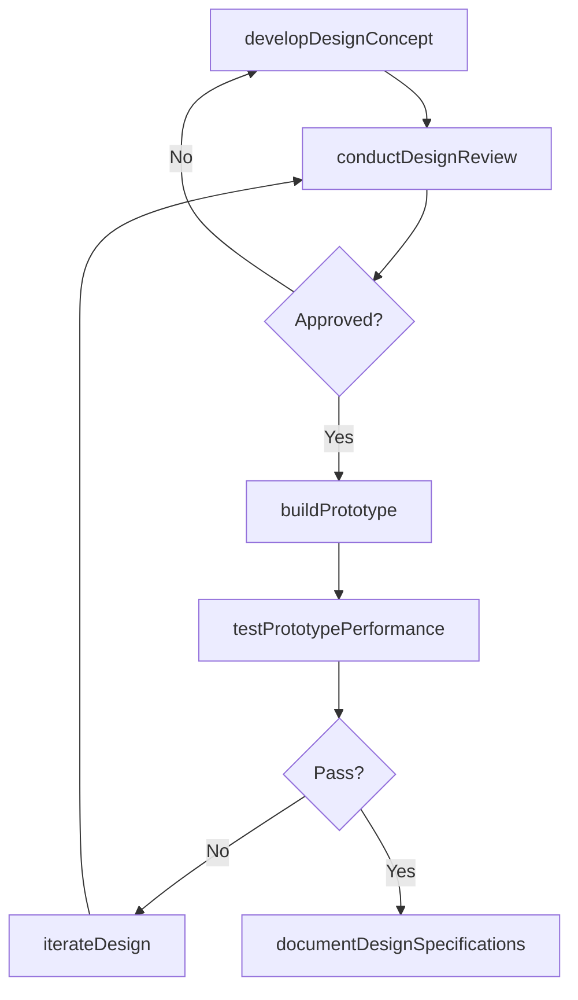

# Design products/services

> Business-as-Code definition for design products/services. Models designing and prototyping products and services, from business case preparation through prototype testing and supplier collaboration.

## Overview

Creating a sketch of the customer focused product/service in Develop and Manage Products and Services [10003].

## Process Hierarchy



## GraphDL

```yaml
design:
  object: Products/services
  actor: DesignEngineer
  result: DesignPrototype
```

## Actions

| Action | Description |
|--------|-------------|
| developDesignConcept | Create initial design concepts based on requirements specifications |
| buildPrototype | Construct physical or digital prototypes for testing and validation |
| conductDesignReview | Evaluate design against specifications, standards, and constraints |
| testPrototypePerformance | Execute tests to validate prototype functionality and reliability |
| iterateDesign | Refine design based on review feedback and test results |
| documentDesignSpecifications | Record finalized design details, tolerances, and materials |

## Events

| Event | Description |
|-------|-------------|
| designConceptDeveloped | Initial design concept created |
| prototypeBuilt | Prototype constructed and ready for testing |
| designReviewConducted | Design evaluation against specifications completed |
| prototypePerformanceTested | Prototype test results documented |
| designIterated | Design refined based on feedback |
| designSpecificationsDocumented | Final design specifications recorded |

## Searches

| Search | Description |
|--------|-------------|
| getDesignDocuments | Retrieve design specifications and drawings by product |
| getPrototypeTestResults | Access prototype testing data and pass/fail results |
| getDesignReviewHistory | Retrieve design review records and action items |
| getDesignChangeLog | Access history of design iterations and modifications |

## Process Flow



## RACI Matrix

| Activity | Responsible | Accountable | Consulted | Informed |
|----------|-------------|-------------|-----------|----------|
| developDesignConcept | DesignEngineer | VP Engineering | Product, Manufacturing | Quality |
| buildPrototype | PrototypeEngineer | VP Engineering | Manufacturing, Suppliers | Product |
| conductDesignReview | DesignLead | VP Engineering | Quality, Regulatory | Executive |
| testPrototypePerformance | TestEngineer | VP Engineering | Quality | Product |

## Sub-Processes

| ID | Name | Description |
|----|------|-------------|
| 2.3.1.8.1 | Design for manufacturing | Carrying out the steps necessary to appropriately manufacture correct parts.  This includes designin |
| 2.3.1.8.2 | Design for product servicing | Creating product application service view to allow for product servicing and refurbishing. |
| 2.3.1.8.3 | Design for re-manufacturing | Replacing core components and republishing. |
| 2.3.1.8.4 | Review product troubleshooting methodology | Reviewing the design and approach for troubleshooting the product. |
| 2.3.1.8.5 | Design and manage product data, design, and bill of materials | Designing the BOM-Bill of material, manufacturing BOM and Service BOMA bill of materials list for al |
| 2.3.1.8.6 | Design for product upgrades | Designing hardware and software upgrade techniques. |

## Related Processes

| Process | Relationship |
|---------|-------------|
| 2.2.3 Define product/service development requirements | Upstream - requirements guide design activities |
| 2.3.2 Test market for new or revised products and services | Downstream - prototypes enter market testing |
| 2.3.3 Prepare for production and marketplace introduction | Downstream - finalized designs move to production preparation |

## Related Departments

| Department | Role |
|-----------|------|
| Engineering | Leads design development and prototyping |
| Manufacturing | Provides manufacturing feasibility input |
| Quality Assurance | Validates design against quality standards |
| Procurement | Sources prototype materials and components |

## Related Occupations

| Occupation | Involvement |
|-----------|-------------|
| Design Engineer | Creates product design concepts and specifications |
| Prototype Engineer | Builds and tests product prototypes |
| Test Engineer | Executes prototype validation testing |

## KPIs

| KPI | Description | Unit |
|-----|-------------|------|
| Design Iteration Count | Number of design revisions before final approval | Iterations |
| Prototype Test Pass Rate | Percentage of prototype tests passing on first attempt | % |
| Design Review Cycle Time | Average time from design submission to review completion | Days |
| Design-to-Prototype Time | Duration from concept approval to working prototype | Weeks |

## Usage

```typescript
import { designProductsservices } from '@headlessly/design-productsservices'

const client = designProductsservices()

// Create initial design concepts based on requirements specifications
const result = await client.developDesignConcept({
  productId: 'prod-2025-a'
})

// Construct physical or digital prototypes for testing and validation
const result2 = await client.buildPrototype({
  productId: 'prod-2025-a'
})
```
