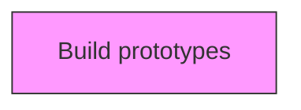
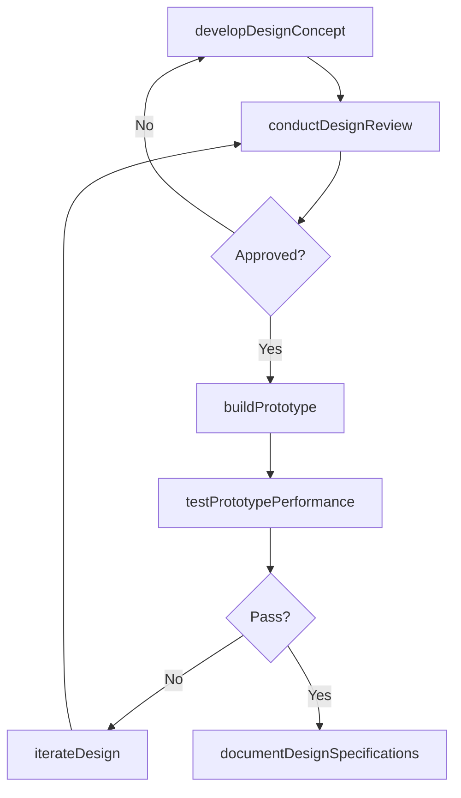

# Build prototypes

> Business-as-Code definition for build prototypes. Models designing and prototyping products and services, from business case preparation through prototype testing and supplier collaboration.

## Overview

Constructing functional prototypes using rapid prototyping methods, 3D printing, CNC machining, or traditional fabrication techniques to create tangible representations of product designs. Translating design specifications into physical or digital prototypes that can be evaluated for form, fit, and function. Building prototypes at various fidelity levels from concept models to production-representative samples to support iterative design validation and stakeholder review.

## Process Hierarchy



## GraphDL

```yaml
build:
  object: Prototypes
  actor: DesignEngineer
  result: DesignPrototype
```

## Actions

| Action | Description |
|--------|-------------|
| developDesignConcept | Create initial design concepts based on requirements specifications |
| buildPrototype | Construct physical or digital prototypes for testing and validation |
| conductDesignReview | Evaluate design against specifications, standards, and constraints |
| testPrototypePerformance | Execute tests to validate prototype functionality and reliability |
| iterateDesign | Refine design based on review feedback and test results |
| documentDesignSpecifications | Record finalized design details, tolerances, and materials |

## Events

| Event | Description |
|-------|-------------|
| designConceptDeveloped | Initial design concept created |
| prototypeBuilt | Prototype constructed and ready for testing |
| designReviewConducted | Design evaluation against specifications completed |
| prototypePerformanceTested | Prototype test results documented |
| designIterated | Design refined based on feedback |
| designSpecificationsDocumented | Final design specifications recorded |

## Searches

| Search | Description |
|--------|-------------|
| getDesignDocuments | Retrieve design specifications and drawings by product |
| getPrototypeTestResults | Access prototype testing data and pass/fail results |
| getDesignReviewHistory | Retrieve design review records and action items |
| getDesignChangeLog | Access history of design iterations and modifications |

## Process Flow



## RACI Matrix

| Activity | Responsible | Accountable | Consulted | Informed |
|----------|-------------|-------------|-----------|----------|
| developDesignConcept | DesignEngineer | VP Engineering | Product, Manufacturing | Quality |
| buildPrototype | PrototypeEngineer | VP Engineering | Manufacturing, Suppliers | Product |
| conductDesignReview | DesignLead | VP Engineering | Quality, Regulatory | Executive |
| testPrototypePerformance | TestEngineer | VP Engineering | Quality | Product |

## Related Processes

| Process | Relationship |
|---------|-------------|
| 2.2.3 Define product/service development requirements | Upstream - requirements guide design activities |
| 2.3.2 Test market for new or revised products and services | Downstream - prototypes enter market testing |
| 2.3.3 Prepare for production and marketplace introduction | Downstream - finalized designs move to production preparation |

## Related Departments

| Department | Role |
|-----------|------|
| Engineering | Leads design development and prototyping |
| Manufacturing | Provides manufacturing feasibility input |
| Quality Assurance | Validates design against quality standards |
| Procurement | Sources prototype materials and components |

## Related Occupations

| Occupation | Involvement |
|-----------|-------------|
| Design Engineer | Creates product design concepts and specifications |
| Prototype Engineer | Builds and tests product prototypes |
| Test Engineer | Executes prototype validation testing |

## KPIs

| KPI | Description | Unit |
|-----|-------------|------|
| Design Iteration Count | Number of design revisions before final approval | Iterations |
| Prototype Test Pass Rate | Percentage of prototype tests passing on first attempt | % |
| Design Review Cycle Time | Average time from design submission to review completion | Days |
| Design-to-Prototype Time | Duration from concept approval to working prototype | Weeks |

## Usage

```typescript
import { buildPrototypes } from '@headlessly/build-prototypes'

const client = buildPrototypes()

// Create initial design concepts based on requirements specifications
const result = await client.developDesignConcept({
  productId: 'prod-2025-a'
})

// Construct physical or digital prototypes for testing and validation
const result2 = await client.buildPrototype({
  productId: 'prod-2025-a'
})
```
