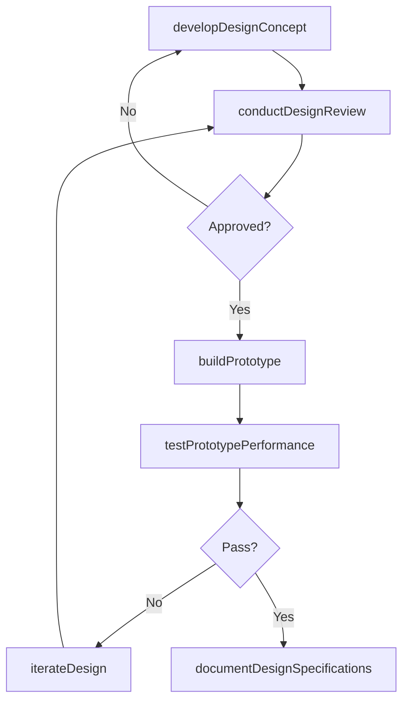

# Design and prototype products and services

> Business-as-Code definition for design and prototype products and services. Models designing and prototyping products and services, from business case preparation through prototype testing and supplier collaboration.

## Overview

Sketching and standardizing product and service based on the market. Analyze the data market competitiveness and innovation attained for the product and service development.

## Process Hierarchy

```mermaid
graph TD
    A[Design and prototype products and services]
    A --> B[Assign resources to product/service project]
    A --> C[Prepare high-level business case and technical assessment]
    A --> D[Develop product/service design specifications]
    A --> E[Develop user experience design specifications]
    A --> F[Provide warranty-related recommendations]
    A --> G[Document design specifications]
    A --> H[Conduct mandatory and elective external reviews]
    A --> I[Design products/services]
    A --> J[Build prototypes/proof of concepts]
    A --> K[Develop and test prototype production and/or service delivery process]
    A --> L[Eliminate quality and reliability problems]
    A --> M[Collaborate on design with suppliers and external partners]
    A --> N[Develop first run/sample products]
```



## GraphDL

```yaml
design:
  object: And Prototype Products And Services
  actor: DesignEngineer
  result: DesignPrototype
```

## Actions

| Action | Description |
|--------|-------------|
| developDesignConcept | Create initial design concepts based on requirements specifications |
| buildPrototype | Construct physical or digital prototypes for testing and validation |
| conductDesignReview | Evaluate design against specifications, standards, and constraints |
| testPrototypePerformance | Execute tests to validate prototype functionality and reliability |
| iterateDesign | Refine design based on review feedback and test results |
| documentDesignSpecifications | Record finalized design details, tolerances, and materials |

## Events

| Event | Description |
|-------|-------------|
| designConceptDeveloped | Initial design concept created |
| prototypeBuilt | Prototype constructed and ready for testing |
| designReviewConducted | Design evaluation against specifications completed |
| prototypePerformanceTested | Prototype test results documented |
| designIterated | Design refined based on feedback |
| designSpecificationsDocumented | Final design specifications recorded |

## Searches

| Search | Description |
|--------|-------------|
| getDesignDocuments | Retrieve design specifications and drawings by product |
| getPrototypeTestResults | Access prototype testing data and pass/fail results |
| getDesignReviewHistory | Retrieve design review records and action items |
| getDesignChangeLog | Access history of design iterations and modifications |

## Process Flow



## RACI Matrix

| Activity | Responsible | Accountable | Consulted | Informed |
|----------|-------------|-------------|-----------|----------|
| developDesignConcept | DesignEngineer | VP Engineering | Product, Manufacturing | Quality |
| buildPrototype | PrototypeEngineer | VP Engineering | Manufacturing, Suppliers | Product |
| conductDesignReview | DesignLead | VP Engineering | Quality, Regulatory | Executive |
| testPrototypePerformance | TestEngineer | VP Engineering | Quality | Product |

## Sub-Processes

| ID | Name | Description |
|----|------|-------------|
| 2.3.1.1 | Assign resources to product/service project | Allocating resources to the design, development, and evaluation of product/service concepts. Allocat |
| 2.3.1.2 | Prepare high-level business case and technical assessment | Preparing a business-level business case and a technical feasibility assessment in order to move the |
| 2.3.1.3 | Develop product/service design specifications | Creating design specifications. Create specifications for the design of new or revised product/servi |
| 2.3.1.4 | Develop user experience design specifications | Determining the usability and user experience of products and the business impact it creates. |
| 2.3.1.5 | Provide warranty-related recommendations | Providing warranty plan and pricing specifications for recommendation. |
| 2.3.1.6 | Document design specifications | Documenting requirements to meet in the design of new or revised products/services. Specify technica |
| 2.3.1.7 | Conduct mandatory and elective external reviews | Conducting any mandatory and elective appraisals of the product/service design specifications in ord |
| 2.3.1.8 | Design products/services | Creating a sketch of the customer focused product/service in Develop and Manage Products and Service |
| 2.3.1.9 | Build prototypes/proof of concepts | Building prototypes for shortlisted product/service concepts. Develop prototypes for those product/s |
| 2.3.1.10 | Develop and test prototype production and/or service delivery process | Creating the new manufacturing/delivery processes for the new products/services, and testing them to |
| 2.3.1.11 | Eliminate quality and reliability problems | Eliminating any problems relating to utility of the product/service over the course of its expected  |
| 2.3.1.12 | Collaborate on design with suppliers and external partners | Interacting with suppliers and manufactures to determine design decisions. Collaborate with vendors, |
| 2.3.1.13 | Develop first run/sample products | Producing initial sample or first-run products to validate manufacturing processes, refine formulati |

## Related Processes

| Process | Relationship |
|---------|-------------|
| 2.2.3 Define product/service development requirements | Upstream - requirements guide design activities |
| 2.3.2 Test market for new or revised products and services | Downstream - prototypes enter market testing |
| 2.3.3 Prepare for production and marketplace introduction | Downstream - finalized designs move to production preparation |

## Related Departments

| Department | Role |
|-----------|------|
| Engineering | Leads design development and prototyping |
| Manufacturing | Provides manufacturing feasibility input |
| Quality Assurance | Validates design against quality standards |
| Procurement | Sources prototype materials and components |

## Related Occupations

| Occupation | Involvement |
|-----------|-------------|
| Design Engineer | Creates product design concepts and specifications |
| Prototype Engineer | Builds and tests product prototypes |
| Test Engineer | Executes prototype validation testing |

## KPIs

| KPI | Description | Unit |
|-----|-------------|------|
| Design Iteration Count | Number of design revisions before final approval | Iterations |
| Prototype Test Pass Rate | Percentage of prototype tests passing on first attempt | % |
| Design Review Cycle Time | Average time from design submission to review completion | Days |
| Design-to-Prototype Time | Duration from concept approval to working prototype | Weeks |

## Usage

```typescript
import { designAndPrototypeProductsAndServices } from '@headlessly/design-and-prototype-products-and-services'

const client = designAndPrototypeProductsAndServices()

// Create initial design concepts based on requirements specifications
const result = await client.developDesignConcept({
  productId: 'prod-2025-a'
})

// Construct physical or digital prototypes for testing and validation
const result2 = await client.buildPrototype({
  productId: 'prod-2025-a'
})
```
