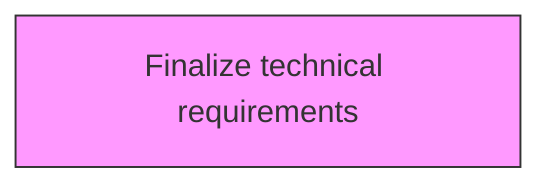
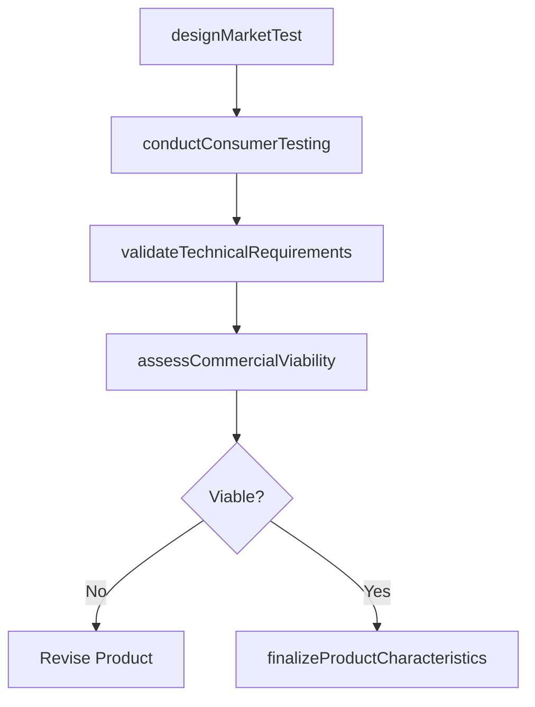

# Finalize technical requirements

> Business-as-Code definition for finalize technical requirements. Models testing the market for new or revised products and services through consumer testing, regulatory review, and commercial validation.

## Overview

Reassessing the technical requirements in light of the final product/service attributes. Revisit the technical assessment to revalidate the organization's capacity for progressing with new product/service projects, in light of the revised product/service characteristics.

## Process Hierarchy



## GraphDL

```yaml
finalize:
  object: Technical Requirements
  actor: MarketTestManager
  result: MarketTestReport
```

## Actions

| Action | Description |
|--------|-------------|
| designMarketTest | Plan market testing methodology, sample selection, and success criteria |
| conductConsumerTesting | Execute consumer trials, interviews, and preference studies |
| validateTechnicalRequirements | Confirm product meets all technical and regulatory specifications |
| assessCommercialViability | Evaluate pricing, positioning, and demand projections |
| finalizeProductCharacteristics | Lock product features, packaging, and claims based on test results |

## Events

| Event | Description |
|-------|-------------|
| marketTestDesigned | Market testing methodology and criteria established |
| consumerTestingConducted | Consumer trials and interviews completed |
| technicalRequirementsValidated | Technical and regulatory specifications confirmed |
| commercialViabilityAssessed | Pricing and demand analysis finalized |
| productCharacteristicsFinalized | Product features and claims locked for production |

## Searches

| Search | Description |
|--------|-------------|
| getMarketTestResults | Retrieve consumer testing data and preference scores |
| getTechnicalValidation | Access technical requirement validation results |
| getCommercialProjections | Retrieve demand forecasts and pricing analysis |

## Process Flow



## RACI Matrix

| Activity | Responsible | Accountable | Consulted | Informed |
|----------|-------------|-------------|-----------|----------|
| designMarketTest | MarketTestManager | VP Marketing | Product, Sales | Executive |
| conductConsumerTesting | MarketResearcher | VP Marketing | Product | Sales |
| validateTechnicalRequirements | QualityEngineer | VP Engineering | Regulatory | Product |
| finalizeProductCharacteristics | ProductManager | CPO | Marketing, Engineering | AllDepartments |

## Related Processes

| Process | Relationship |
|---------|-------------|
| 2.3.1 Design and prototype products and services | Upstream - prototypes enter market testing |
| 2.3.3 Prepare for production and marketplace introduction | Downstream - validated products move to production |
| 2.1.2.5 Conduct post launch review | Downstream - market test data informs post-launch comparison |

## Related Departments

| Department | Role |
|-----------|------|
| Marketing | Leads market testing and consumer research |
| Product Management | Finalizes product characteristics based on results |
| Quality Assurance | Validates technical and regulatory compliance |
| Sales | Provides commercial viability assessment |

## Related Occupations

| Occupation | Involvement |
|-----------|-------------|
| Market Test Manager | Designs and oversees market testing programs |
| Market Researcher | Conducts consumer trials and interviews |
| Product Manager | Finalizes product characteristics |

## KPIs

| KPI | Description | Unit |
|-----|-------------|------|
| Consumer Preference Score | Average consumer rating of tested product attributes | Score (1-10) |
| Test-to-Launch Rate | Percentage of market-tested products proceeding to launch | % |
| Technical Validation Pass Rate | Percentage of products meeting all technical requirements | % |
| Market Test Cycle Time | Duration from test design to results analysis | Weeks |

## Usage

```typescript
import { finalizeTechnicalRequirements } from '@headlessly/finalize-technical-requirements'

const client = finalizeTechnicalRequirements()

// Plan market testing methodology, sample selection, and success criteria
const result = await client.designMarketTest({
  productId: 'prod-2025-a'
})

// Execute consumer trials, interviews, and preference studies
const result2 = await client.conductConsumerTesting({
  productId: 'prod-2025-a'
})
```
