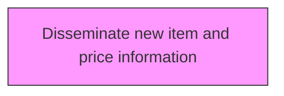
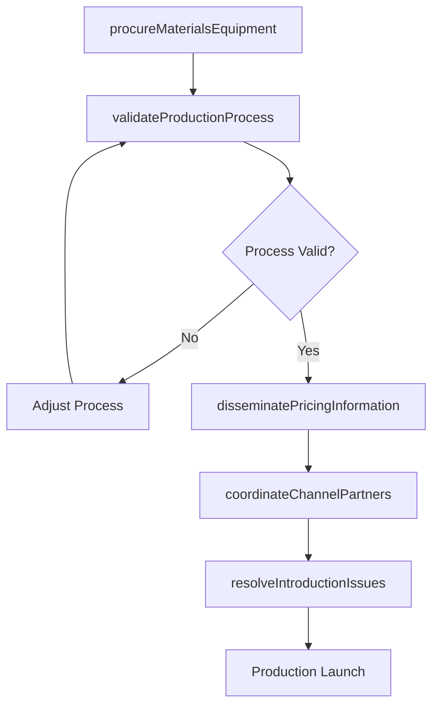

# Disseminate new item and price information

> Business-as-Code definition for disseminate new item and price information. Models preparing for production and marketplace introduction, including material procurement, process validation, and channel coordination.

## Overview

Distributing product specifications, pricing structures, SKU assignments, and promotional details to internal teams, channel partners, and distribution networks. Updating product information management systems, price lists, and catalog databases with new item data. Ensuring that sales teams, customer service representatives, retailers, and distributors have accurate and timely information to support product launch and ongoing sales activities.

## Process Hierarchy



## GraphDL

```yaml
disseminate:
  object: New Item And Price Information
  actor: LaunchCoordinator
  result: ProductionReadinessReport
```

## Actions

| Action | Description |
|--------|-------------|
| procureMaterialsEquipment | Source and acquire materials, tooling, and equipment for production |
| validateProductionProcess | Test and verify manufacturing or service delivery processes |
| coordinateChannelPartners | Align distributors, retailers, and service partners for launch |
| disseminatePricingInformation | Distribute product pricing, SKU details, and availability data |
| resolveIntroductionIssues | Address questions and problems arising during launch preparation |

## Events

| Event | Description |
|-------|-------------|
| materialsEquipmentProcured | Production materials and equipment acquired |
| productionProcessValidated | Manufacturing or service delivery process verified |
| channelPartnersCoordinated | Distribution and retail partners aligned for launch |
| pricingInformationDisseminated | Product pricing and availability data distributed |
| introductionIssuesResolved | Launch preparation issues addressed |

## Searches

| Search | Description |
|--------|-------------|
| getProductionReadiness | Retrieve production readiness status by product |
| getChannelPartnerStatus | Access distribution partner preparation progress |
| getPricingData | Retrieve product pricing and SKU information |

## Process Flow



## RACI Matrix

| Activity | Responsible | Accountable | Consulted | Informed |
|----------|-------------|-------------|-----------|----------|
| procureMaterialsEquipment | ProcurementManager | VP Operations | Engineering, Quality | Finance |
| validateProductionProcess | ManufacturingEngineer | VP Operations | Quality | Product |
| coordinateChannelPartners | ChannelManager | VP Sales | Marketing, Logistics | Finance |
| disseminatePricingInformation | PricingManager | VP Marketing | Finance, Sales | Operations |

## Related Processes

| Process | Relationship |
|---------|-------------|
| 2.3.2 Test market for new or revised products and services | Upstream - market-validated products enter production preparation |
| 2.1.2.2 Introduce new products/services | Downstream - production-ready products proceed to market introduction |
| 2.3.4 Support and implement changes to product manufacturing and service delivery process | Related - production changes may be needed during preparation |

## Related Departments

| Department | Role |
|-----------|------|
| Operations | Leads production preparation and process validation |
| Procurement | Sources materials, equipment, and tooling |
| Sales | Coordinates channel partner readiness |
| Marketing | Prepares pricing and product information for distribution |

## Related Occupations

| Occupation | Involvement |
|-----------|-------------|
| Launch Coordinator | Orchestrates production and launch preparation |
| Manufacturing Engineer | Validates production processes |
| Channel Manager | Coordinates distribution partner readiness |

## KPIs

| KPI | Description | Unit |
|-----|-------------|------|
| Production Readiness Score | Composite assessment of manufacturing readiness | Score (0-100) |
| Channel Coverage | Percentage of target distribution channels prepared for launch | % |
| Process Validation Cycle Time | Duration of production process validation | Days |
| Material Procurement Lead Time | Time from order to delivery of production materials | Weeks |

## Usage

```typescript
import { disseminateNewItemAndPriceInformation } from '@headlessly/disseminate-new-item-and-price-information'

const client = disseminateNewItemAndPriceInformation()

// Source and acquire materials, tooling, and equipment for production
const result = await client.procureMaterialsEquipment({
  productId: 'prod-2025-a'
})

// Test and verify manufacturing or service delivery processes
const result2 = await client.validateProductionProcess({
  productId: 'prod-2025-a'
})
```
