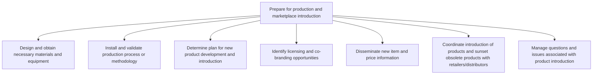
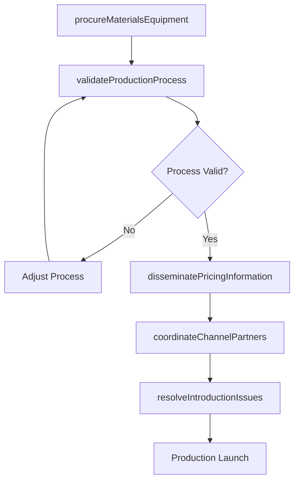

# Prepare for production and marketplace introduction

> Business-as-Code definition for prepare for production and marketplace introduction. Models preparing for production and marketplace introduction, including material procurement, process validation, and channel coordination.

## Overview

Transitioning validated product designs from development into full-scale production and marketplace introduction. Sourcing and procuring necessary materials, tooling, and equipment. Installing and validating manufacturing processes or service delivery methodologies. Formulating go-to-market plans, identifying licensing and co-branding opportunities, disseminating pricing information to sales channels, and coordinating product introductions with retailers and distributors while simultaneously managing the phase-out of obsolete offerings.

## Process Hierarchy



## GraphDL

```yaml
prepare:
  object: For Production And Marketplace Introduction
  actor: LaunchCoordinator
  result: ProductionReadinessReport
```

## Actions

| Action | Description |
|--------|-------------|
| procureMaterialsEquipment | Source and acquire materials, tooling, and equipment for production |
| validateProductionProcess | Test and verify manufacturing or service delivery processes |
| coordinateChannelPartners | Align distributors, retailers, and service partners for launch |
| disseminatePricingInformation | Distribute product pricing, SKU details, and availability data |
| resolveIntroductionIssues | Address questions and problems arising during launch preparation |

## Events

| Event | Description |
|-------|-------------|
| materialsEquipmentProcured | Production materials and equipment acquired |
| productionProcessValidated | Manufacturing or service delivery process verified |
| channelPartnersCoordinated | Distribution and retail partners aligned for launch |
| pricingInformationDisseminated | Product pricing and availability data distributed |
| introductionIssuesResolved | Launch preparation issues addressed |

## Searches

| Search | Description |
|--------|-------------|
| getProductionReadiness | Retrieve production readiness status by product |
| getChannelPartnerStatus | Access distribution partner preparation progress |
| getPricingData | Retrieve product pricing and SKU information |

## Process Flow



## RACI Matrix

| Activity | Responsible | Accountable | Consulted | Informed |
|----------|-------------|-------------|-----------|----------|
| procureMaterialsEquipment | ProcurementManager | VP Operations | Engineering, Quality | Finance |
| validateProductionProcess | ManufacturingEngineer | VP Operations | Quality | Product |
| coordinateChannelPartners | ChannelManager | VP Sales | Marketing, Logistics | Finance |
| disseminatePricingInformation | PricingManager | VP Marketing | Finance, Sales | Operations |

## Sub-Processes

| ID | Name | Description |
|----|------|-------------|
| 2.3.3.1 | Design and obtain necessary materials and equipment | Developing and/or sourcing the essential machinery needed for creating purpose-built processes, as w |
| 2.3.3.2 | Install and validate production process or methodology | Finalizing production process or methodology. Install and initiate the production process to manufac |
| 2.3.3.3 | Determine plan for new product development and introduction | Formulating the comprehensive go-to-market plan including production timelines, distribution strateg |
| 2.3.3.4 | Identify licensing and co-branding opportunities | Evaluating potential licensing agreements, co-branding partnerships, and strategic alliances to exten |
| 2.3.3.5 | Disseminate new item and price information | Distributing product specifications, pricing structures, and promotional details to internal teams,  |
| 2.3.3.6 | Coordinate introduction of products and sunset obsolete products with retailers/distributors | Orchestrating the simultaneous launch of new products and phase-out of legacy offerings across retai |
| 2.3.3.7 | Manage questions and issues associated with product introduction | Addressing inquiries, resolving issues, and managing escalations from channel partners, customers, a |

## Related Processes

| Process | Relationship |
|---------|-------------|
| 2.3.2 Test market for new or revised products and services | Upstream - market-validated products enter production preparation |
| 2.1.2.2 Introduce new products/services | Downstream - production-ready products proceed to market introduction |
| 2.3.4 Support and implement changes to product manufacturing and service delivery process | Related - production changes may be needed during preparation |

## Related Departments

| Department | Role |
|-----------|------|
| Operations | Leads production preparation and process validation |
| Procurement | Sources materials, equipment, and tooling |
| Sales | Coordinates channel partner readiness |
| Marketing | Prepares pricing and product information for distribution |

## Related Occupations

| Occupation | Involvement |
|-----------|-------------|
| Launch Coordinator | Orchestrates production and launch preparation |
| Manufacturing Engineer | Validates production processes |
| Channel Manager | Coordinates distribution partner readiness |

## KPIs

| KPI | Description | Unit |
|-----|-------------|------|
| Production Readiness Score | Composite assessment of manufacturing readiness | Score (0-100) |
| Channel Coverage | Percentage of target distribution channels prepared for launch | % |
| Process Validation Cycle Time | Duration of production process validation | Days |
| Material Procurement Lead Time | Time from order to delivery of production materials | Weeks |

## Usage

```typescript
import { prepareForProductionAndMarketplaceIntroduction } from '@headlessly/prepare-for-production-and-marketplace-introduction'

const client = prepareForProductionAndMarketplaceIntroduction()

// Source and acquire materials, tooling, and equipment for production
const result = await client.procureMaterialsEquipment({
  productId: 'prod-2025-a'
})

// Test and verify manufacturing or service delivery processes
const result2 = await client.validateProductionProcess({
  productId: 'prod-2025-a'
})
```
