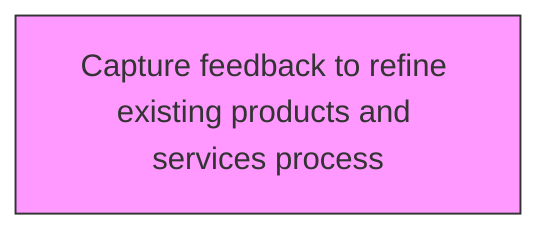
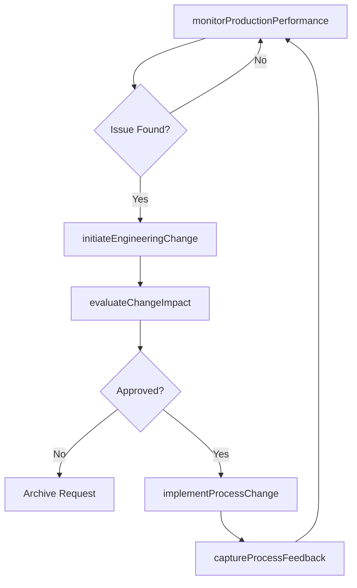

# Capture feedback to refine existing products and services process

> Business-as-Code definition for capture feedback to refine existing products and services process. Models supporting and implementing changes to product manufacturing and service delivery processes through engineering change management.

## Overview

Collecting and synthesizing feedback from production operators, service delivery teams, customers, and quality inspectors to identify refinement opportunities for existing products and processes. Establishing structured feedback channels such as production floor suggestion systems, post-delivery surveys, and cross-functional review sessions. Analyzing feedback trends to prioritize improvement actions and routing actionable insights to product engineering, manufacturing, and quality assurance teams for resolution.

## Process Hierarchy



## GraphDL

```yaml
capture:
  object: Feedback To Refine Existing Products And Services Process
  actor: ManufacturingEngineer
  result: EngineeringChangeRecord
```

## Actions

| Action | Description |
|--------|-------------|
| monitorProductionPerformance | Track manufacturing output quality, efficiency, and yield rates |
| initiateEngineeringChange | Submit engineering change requests based on production findings |
| evaluateChangeImpact | Assess effects of proposed changes on cost, quality, and schedule |
| implementProcessChange | Execute approved changes to manufacturing or delivery processes |
| captureProcessFeedback | Collect feedback from production teams to refine processes |

## Events

| Event | Description |
|-------|-------------|
| productionPerformanceMonitored | Manufacturing performance data collected and analyzed |
| engineeringChangeInitiated | Engineering change request submitted |
| changeImpactEvaluated | Change impact assessment completed |
| processChangeImplemented | Approved changes applied to manufacturing process |
| processFeedbackCaptured | Production feedback collected and documented |

## Searches

| Search | Description |
|--------|-------------|
| getEngineeringChanges | Retrieve engineering change requests and orders by status |
| getProductionMetrics | Access manufacturing performance data |
| getChangeImpactAssessments | Retrieve impact analyses for proposed changes |

## Process Flow



## RACI Matrix

| Activity | Responsible | Accountable | Consulted | Informed |
|----------|-------------|-------------|-----------|----------|
| monitorProductionPerformance | ProductionManager | VP Operations | Quality | Engineering |
| initiateEngineeringChange | ManufacturingEngineer | VP Engineering | Product, Quality | Operations |
| evaluateChangeImpact | ManufacturingEngineer | VP Engineering | Finance, Operations | Product |
| implementProcessChange | ManufacturingEngineer | VP Operations | Quality | AllDepartments |

## Related Processes

| Process | Relationship |
|---------|-------------|
| 2.3.3 Prepare for production and marketplace introduction | Upstream - production setup may require process changes |
| 2.1.2.5 Conduct post launch review | Related - post-launch quality issues drive engineering changes |
| 2.1.4 Manage product and service master data | Related - engineering changes update master data |

## Related Departments

| Department | Role |
|-----------|------|
| Manufacturing | Leads production process changes and monitoring |
| Engineering | Designs and validates process improvements |
| Quality Assurance | Validates changes meet quality standards |
| Operations | Implements process changes on the production floor |

## Related Occupations

| Occupation | Involvement |
|-----------|-------------|
| Manufacturing Engineer | Designs and implements process changes |
| Production Manager | Monitors production performance |
| Quality Engineer | Validates change impact on product quality |

## KPIs

| KPI | Description | Unit |
|-----|-------------|------|
| Engineering Change Cycle Time | Average time from change request to implementation | Days |
| Change Approval Rate | Percentage of engineering change requests approved | % |
| Production Yield Improvement | Yield increase achieved through process changes | % |
| First Pass Quality Rate | Percentage of products passing quality checks after process change | % |

## Usage

```typescript
import { captureFeedbackToRefineExistingProductsAndServicesProcess } from '@headlessly/capture-feedback-to-refine-existing-products-and-services-process'

const client = captureFeedbackToRefineExistingProductsAndServicesProcess()

// Track manufacturing output quality, efficiency, and yield rates
const result = await client.monitorProductionPerformance({
  productId: 'prod-2025-a'
})

// Submit engineering change requests based on production findings
const result2 = await client.initiateEngineeringChange({
  productId: 'prod-2025-a'
})
```
