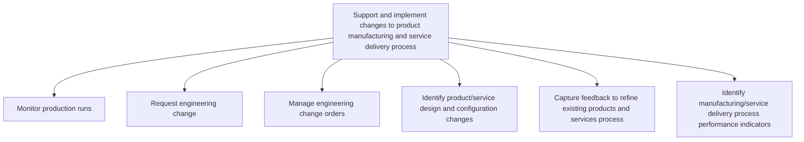
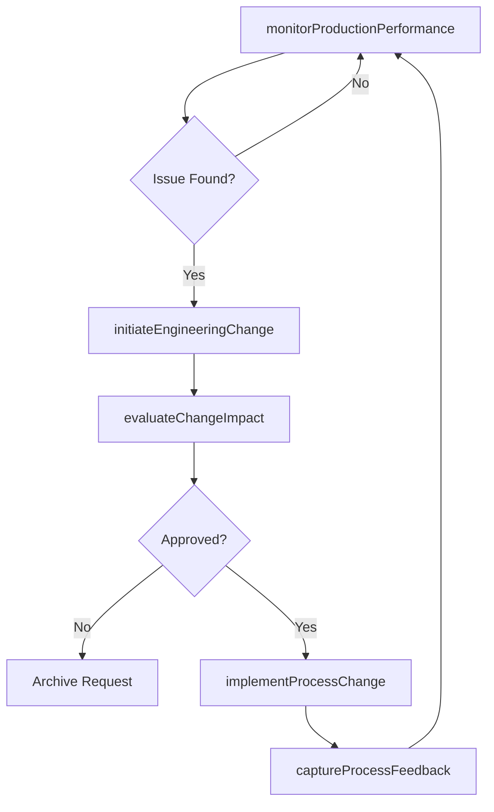

# Support and implement changes to product manufacturing and service delivery process

> Business-as-Code definition for support and implement changes to product manufacturing and service delivery process. Models supporting and implementing changes to product manufacturing and service delivery processes through engineering change management.

## Overview

Managing the ongoing lifecycle of product manufacturing and service delivery processes after initial production launch. Monitoring production runs for quality, efficiency, and throughput. Initiating, evaluating, and implementing engineering change requests to address defects, improve yields, or incorporate design updates. Capturing feedback from production floor teams and service delivery personnel to drive continuous improvement. Defining and tracking key performance indicators for manufacturing and service delivery effectiveness.

## Process Hierarchy



## GraphDL

```yaml
support:
  object: And Implement Changes To Product Manufacturing And Service Delivery Process
  actor: ManufacturingEngineer
  result: EngineeringChangeRecord
```

## Actions

| Action | Description |
|--------|-------------|
| monitorProductionPerformance | Track manufacturing output quality, efficiency, and yield rates |
| initiateEngineeringChange | Submit engineering change requests based on production findings |
| evaluateChangeImpact | Assess effects of proposed changes on cost, quality, and schedule |
| implementProcessChange | Execute approved changes to manufacturing or delivery processes |
| captureProcessFeedback | Collect feedback from production teams to refine processes |

## Events

| Event | Description |
|-------|-------------|
| productionPerformanceMonitored | Manufacturing performance data collected and analyzed |
| engineeringChangeInitiated | Engineering change request submitted |
| changeImpactEvaluated | Change impact assessment completed |
| processChangeImplemented | Approved changes applied to manufacturing process |
| processFeedbackCaptured | Production feedback collected and documented |

## Searches

| Search | Description |
|--------|-------------|
| getEngineeringChanges | Retrieve engineering change requests and orders by status |
| getProductionMetrics | Access manufacturing performance data |
| getChangeImpactAssessments | Retrieve impact analyses for proposed changes |

## Process Flow



## RACI Matrix

| Activity | Responsible | Accountable | Consulted | Informed |
|----------|-------------|-------------|-----------|----------|
| monitorProductionPerformance | ProductionManager | VP Operations | Quality | Engineering |
| initiateEngineeringChange | ManufacturingEngineer | VP Engineering | Product, Quality | Operations |
| evaluateChangeImpact | ManufacturingEngineer | VP Engineering | Finance, Operations | Product |
| implementProcessChange | ManufacturingEngineer | VP Operations | Quality | AllDepartments |

## Sub-Processes

| ID | Name | Description |
|----|------|-------------|
| 2.3.4.1 | Monitor production runs | Regularly monitoring production runs of the production and/or delivery operations. |
| 2.3.4.2 | Request engineering change | Requesting changes in the production and/or delivery operations for processing the new or revised pr |
| 2.3.4.3 | Manage engineering change orders | Coordinating the implementation of requests for component changes, equipment repairs, and the optimi |
| 2.3.4.4 | Identify product/service design and configuration changes | Reviewing product and service designs to detect opportunities for configuration updates, component substitutions, or design modifications that improve manufacturability, reduce costs, or enhance performance. |
| 2.3.4.5 | Capture feedback to refine existing products and services process | Collecting and synthesizing feedback from production operators, service delivery teams, customers, and quality inspectors to identify refinement opportunities for existing products and processes. |
| 2.3.4.6 | Identify manufacturing/service delivery process performance indicators | Defining, selecting, and calibrating key performance indicators that measure the effectiveness, efficiency, and quality of manufacturing and service delivery processes. |

## Related Processes

| Process | Relationship |
|---------|-------------|
| 2.3.3 Prepare for production and marketplace introduction | Upstream - production setup may require process changes |
| 2.1.2.5 Conduct post launch review | Related - post-launch quality issues drive engineering changes |
| 2.1.4 Manage product and service master data | Related - engineering changes update master data |

## Related Departments

| Department | Role |
|-----------|------|
| Manufacturing | Leads production process changes and monitoring |
| Engineering | Designs and validates process improvements |
| Quality Assurance | Validates changes meet quality standards |
| Operations | Implements process changes on the production floor |

## Related Occupations

| Occupation | Involvement |
|-----------|-------------|
| Manufacturing Engineer | Designs and implements process changes |
| Production Manager | Monitors production performance |
| Quality Engineer | Validates change impact on product quality |

## KPIs

| KPI | Description | Unit |
|-----|-------------|------|
| Engineering Change Cycle Time | Average time from change request to implementation | Days |
| Change Approval Rate | Percentage of engineering change requests approved | % |
| Production Yield Improvement | Yield increase achieved through process changes | % |
| First Pass Quality Rate | Percentage of products passing quality checks after process change | % |

## Usage

```typescript
import { supportAndImplementChangesToProductManufacturingAndServiceDeliveryProcess } from '@headlessly/support-and-implement-changes-to-product-manufacturing-and-service-delivery-process'

const client = supportAndImplementChangesToProductManufacturingAndServiceDeliveryProcess()

// Track manufacturing output quality, efficiency, and yield rates
const result = await client.monitorProductionPerformance({
  productId: 'prod-2025-a'
})

// Submit engineering change requests based on production findings
const result2 = await client.initiateEngineeringChange({
  productId: 'prod-2025-a'
})
```
