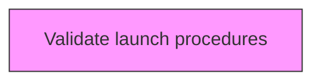
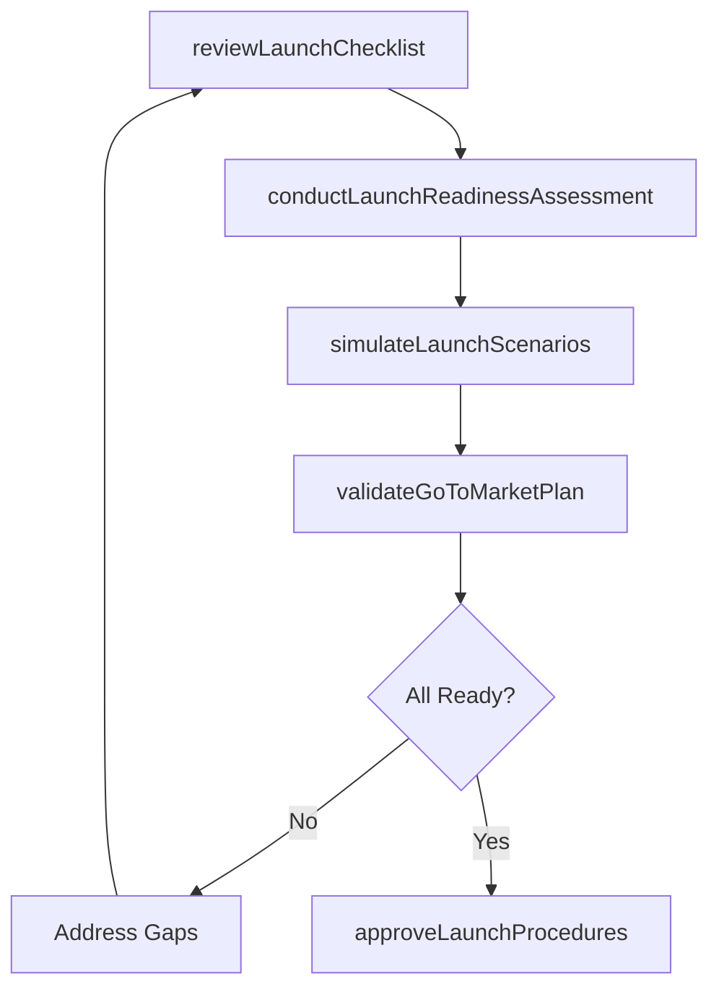

# Validate launch procedures

> Business-as-Code definition for validate launch procedures. Models validating launch procedures to confirm readiness for market introduction.

## Overview

Verifying the measures/processes/techniques through systems and tools involved in the introduction of products and services.

## Process Hierarchy



## GraphDL

```yaml
validate:
  object: Launch Procedures
  actor: LaunchValidator
  result: LaunchValidationReport
```

## Actions

| Action | Description |
|--------|-------------|
| reviewLaunchChecklist | Verify all launch prerequisites have been met across functions |
| conductLaunchReadinessAssessment | Perform comprehensive evaluation of production, marketing, and sales readiness |
| simulateLaunchScenarios | Run through launch scenarios to identify potential issues |
| validateGoToMarketPlan | Confirm the go-to-market strategy and execution plan are complete |
| approveLaunchProcedures | Formally authorize launch procedures for execution |

## Events

| Event | Description |
|-------|-------------|
| launchChecklistReviewed | All launch prerequisites verified |
| launchReadinessAssessed | Comprehensive readiness evaluation completed |
| launchScenariosSimulated | Launch scenario testing completed |
| goToMarketPlanValidated | Go-to-market strategy and plan confirmed |
| launchProceduresApproved | Launch procedures formally authorized |

## Searches

| Search | Description |
|--------|-------------|
| getLaunchReadiness | Retrieve launch readiness scores by function |
| getLaunchChecklistStatus | Access launch checklist completion status |
| getLaunchScenarioResults | Retrieve results from launch scenario simulations |

## Process Flow



## RACI Matrix

| Activity | Responsible | Accountable | Consulted | Informed |
|----------|-------------|-------------|-----------|----------|
| reviewLaunchChecklist | LaunchValidator | VP Product | AllDepartments | Executive |
| conductLaunchReadinessAssessment | LaunchValidator | CPO | Operations, Marketing, Sales | Board |
| approveLaunchProcedures | LaunchValidator | CEO | CPO, CMO, COO | AllDepartments |

## Related Processes

| Process | Relationship |
|---------|-------------|
| 2.3.3 Prepare for production and marketplace introduction | Upstream - production readiness is a key launch prerequisite |
| 2.1.2.2 Introduce new products/services | Downstream - validated procedures guide market introduction |
| 2.1.2.1 Develop plan for new product/service development and introduction/launch | Related - launch plan is the basis for validation |

## Related Departments

| Department | Role |
|-----------|------|
| Product Management | Leads launch validation and readiness assessment |
| Marketing | Validates go-to-market plan readiness |
| Operations | Confirms production and fulfillment readiness |
| Sales | Validates channel readiness and sales enablement |

## Related Occupations

| Occupation | Involvement |
|-----------|-------------|
| Launch Validation Manager | Leads launch procedure validation |
| Program Manager | Coordinates cross-functional readiness assessment |
| Operations Director | Validates operational readiness |

## KPIs

| KPI | Description | Unit |
|-----|-------------|------|
| Launch Readiness Score | Composite score of all launch prerequisites | Score (0-100) |
| Checklist Completion Rate | Percentage of launch checklist items verified | % |
| Issue Resolution Rate | Percentage of identified launch issues resolved before launch | % |

## Usage

```typescript
import { validateLaunchProcedures } from '@headlessly/validate-launch-procedures'

const client = validateLaunchProcedures()

// Verify all launch prerequisites have been met across functions
const result = await client.reviewLaunchChecklist({
  productId: 'prod-2025-a'
})

// Perform comprehensive evaluation of production, marketing, and sales readiness
const result2 = await client.conductLaunchReadinessAssessment({
  productId: 'prod-2025-a'
})
```
