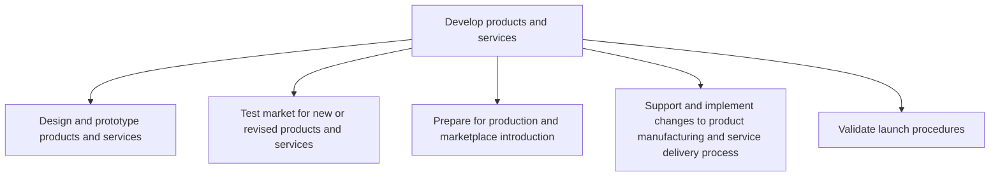
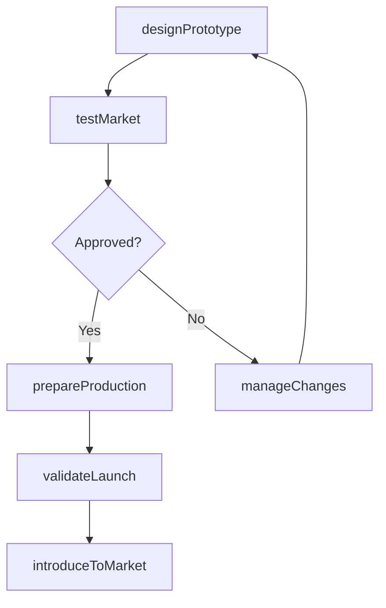

# Develop products and services

> Business-as-Code definition for product and service development. Models the design, prototyping, market testing, production preparation, manufacturing support, and launch validation processes for bringing new offerings to market.

## Overview

Developing new products/services from scratch, including all activities associated with the design, prototyping, evaluation, and market testing of these planned offerings.

## Process Hierarchy



## GraphDL

```yaml
develop:
  object: Products And Services
  actor: ProductDevelopmentLead
  result: MarketReadyProduct
```

## Actions

| Action | Description |
|--------|-------------|
| designPrototype | Create detailed designs and build functional prototypes |
| testMarket | Validate product-market fit through customer tests and interviews |
| prepareProduction | Set up manufacturing processes and supply chain for launch |
| manageChanges | Process engineering change orders and design modifications |
| validateLaunch | Verify launch readiness through comprehensive procedure validation |
| introduceToMarket | Coordinate marketplace introduction with all stakeholder groups |

## Events

| Event | Description |
|-------|-------------|
| prototypeDesigned | Design specifications and functional prototype completed |
| marketTested | Customer and market validation tests completed |
| productionPrepared | Manufacturing process validated and supply chain established |
| changesManaged | Engineering change orders processed and implemented |
| launchValidated | Launch readiness procedures verified and approved |
| productIntroduced | Product or service launched into the marketplace |

## Searches

| Search | Description |
|--------|-------------|
| getProductStatus | Retrieve the current development status for a specific product |
| listPrototypes | List prototypes filtered by stage, product line, or date |
| getTestResults | Access market testing results and customer feedback |
| getChangeOrders | Retrieve engineering change orders by status or product |
| getLaunchReadiness | Access launch readiness checklist and status |

## Process Flow



## RACI Matrix

| Activity | Responsible | Accountable | Consulted | Informed |
|----------|-------------|-------------|-----------|----------|
| designPrototype | DesignEngineer | VP Engineering | ProductManager, UX | Manufacturing |
| testMarket | MarketResearcher | VP Marketing | Sales, Product | Executive |
| prepareProduction | ManufacturingEngineer | VP Operations | SupplyChain, QA | Finance |
| manageChanges | ProductEngineer | VP Engineering | Manufacturing, QA | ProductManager |
| validateLaunch | ProductManager | VP ProductDevelopment | Marketing, Sales, Operations | Executive |

## Sub-Processes

| ID | Name | Description |
|----|------|-------------|
| 2.3.1 | Design and prototype products and services | Sketching and standardizing product and service based on the market. Analyze the data market competi |
| 2.3.2 | Test market for new or revised products and services | Vetting the market before producing new products/services. Contextualize these products/services wit |
| 2.3.3 | Prepare for production and marketplace introduction | Establishing manufacturing processes, sourcing materials and equipment, coordinating distribution ch |
| 2.3.4 | Support and implement changes to product manufacturing and service delivery process | Managing engineering changes, monitoring production runs, capturing feedback to refine manufacturing  |
| 2.3.5 | Validate launch procedures | Verifying the measures/processes/techniques through systems and tools involved in the introduction o |

## Related Processes

| Process | Relationship |
|---------|-------------|
| 2.2 Generate and define new product/service ideas | Upstream - defined requirements trigger the development process |
| 2.1 Govern and manage product/service development program | Governance - portfolio decisions guide development priorities |
| 3.0 Market and Sell Products and Services | Downstream - launched products enter the sales pipeline |
| 4.0 Deliver Products and Services | Downstream - production-ready products enter delivery operations |

## Related Departments

| Department | Role |
|-----------|------|
| Engineering | Designs, prototypes, and iterates on product specifications |
| Manufacturing | Prepares and validates production processes |
| Marketing | Conducts market testing and plans marketplace introduction |
| Quality Assurance | Validates product quality and reliability |
| Supply Chain | Establishes material sourcing and distribution channels |

## Related Occupations

| Occupation | Involvement |
|-----------|-------------|
| Product Development Lead | Coordinates the full development process |
| Design Engineer | Creates product designs and prototypes |
| Manufacturing Engineer | Sets up and validates production processes |
| Quality Engineer | Manages quality testing and reliability |

## KPIs

| KPI | Description | Unit |
|-----|-------------|------|
| Design-to-Prototype Cycle Time | Average time from design start to functional prototype | Weeks |
| Market Test Pass Rate | Percentage of products passing market validation testing | % |
| Engineering Change Order Volume | Number of ECOs per product during development | Count |
| Launch On-Time Rate | Percentage of products launched on or before target date | % |
| First-Year Revenue Achievement | Percentage of products meeting first-year revenue targets | % |

## Usage

```typescript
import { developProductsAndServices } from '@headlessly/develop-products-and-services'

const development = developProductsAndServices()

// Design and build a prototype
const prototype = await development.designPrototype({
  conceptId: 'concept-456',
  designStandard: 'ISO-9001',
  materialConstraints: ['aluminum', 'recyclable-plastics']
})

// Conduct market testing
const testResults = await development.testMarket({
  prototypeId: prototype.id,
  testType: 'consumer-panel',
  sampleSize: 200,
  markets: ['US', 'UK', 'Germany']
})

// Prepare for production and launch
await development.prepareProduction({
  productId: prototype.id,
  productionVolume: 10000,
  targetLaunchDate: '2026-Q3'
})
```
