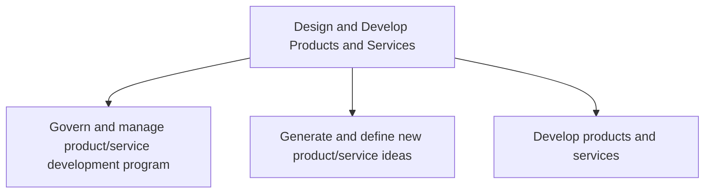
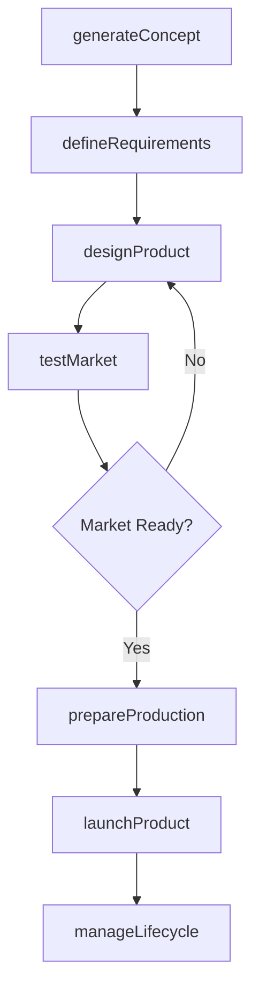

# Design and Develop Products and Services

> Business-as-Code definition for end-to-end product and service development. Models the complete lifecycle from idea generation and portfolio governance through design, prototyping, testing, and market introduction.

## Overview

Managing the full spectrum of product and service development activities. This includes governing the development program and portfolio, generating and evaluating new product and service ideas, designing and prototyping solutions, testing market readiness, and preparing for production and marketplace introduction. The process ensures alignment between market needs, organizational capabilities, and innovation priorities.

## Process Hierarchy



## GraphDL

```yaml
design:
  object: And Develop Products And Services
  actor: VP ProductDevelopment
  result: ProductPortfolio
```

## Actions

| Action | Description |
|--------|-------------|
| generateConcept | Create and evaluate new product or service concepts |
| defineRequirements | Establish functional, technical, and regulatory requirements |
| designProduct | Develop detailed design specifications and prototypes |
| testMarket | Validate product-market fit through customer and market testing |
| prepareProduction | Set up manufacturing or service delivery processes for launch |
| launchProduct | Introduce the product or service to the marketplace |
| manageLifecycle | Govern the product through growth, maturity, and retirement phases |

## Events

| Event | Description |
|-------|-------------|
| conceptGenerated | New product or service concept documented and evaluated |
| requirementsDefined | Product requirements specification finalized |
| productDesigned | Design specifications and prototypes completed |
| marketTested | Market validation and customer testing completed |
| productionPrepared | Manufacturing or delivery process validated for launch |
| productLaunched | Product or service introduced to the marketplace |
| lifecycleUpdated | Product lifecycle stage transition recorded |

## Searches

| Search | Description |
|--------|-------------|
| getProductPortfolio | Retrieve current product and service portfolio with lifecycle status |
| listConcepts | List product concepts filtered by stage, category, or priority |
| getRequirements | Retrieve requirements specifications for a given product |
| findLaunchCandidates | Identify products ready for market introduction |
| getLifecycleMetrics | Retrieve performance metrics across the product lifecycle |

## Process Flow



## RACI Matrix

| Activity | Responsible | Accountable | Consulted | Informed |
|----------|-------------|-------------|-----------|----------|
| generateConcept | ProductManager | VP ProductDevelopment | Marketing, Sales | Executive |
| defineRequirements | ProductEngineer | VP ProductDevelopment | Regulatory, QA | Operations |
| designProduct | DesignEngineer | VP Engineering | Manufacturing | ProductManager |
| testMarket | MarketResearcher | VP Marketing | Sales, CustomerSuccess | ProductManager |
| launchProduct | ProductManager | VP ProductDevelopment | Marketing, Sales, Operations | Executive |

## Sub-Processes

| ID | Name | Description |
|----|------|-------------|
| 2.1 | Govern and manage product/service development program | Supervising the complete product/service program from innovation until its commercial success. Meeti |
| 2.2 | Generate and define new product/service ideas | Identifying and describing new product or service thoughts based on organizational objectives/target |
| 2.3 | Develop products and services | Developing new products/services from scratch, including all activities associated with the design,  |

## Related Processes

| Process | Relationship |
|---------|-------------|
| 1.0 Develop Vision and Strategy | Upstream - strategic priorities guide product investment |
| 3.0 Market and Sell Products and Services | Downstream - new products feed the sales pipeline |
| 4.0 Deliver Products and Services | Downstream - production and delivery of launched products |
| 6.0 Manage Enterprise IT | Supporting - technology infrastructure for development |

## Related Departments

| Department | Role |
|-----------|------|
| Product Development | Primary owner of the product creation process |
| Engineering | Designs and builds products and prototypes |
| Marketing | Provides market intelligence and launch support |
| Quality Assurance | Validates product quality and regulatory compliance |
| Operations | Ensures manufacturing and delivery readiness |

## Related Occupations

| Occupation | Involvement |
|-----------|-------------|
| Product Manager | Owns product roadmap and concept prioritization |
| Design Engineer | Creates product specifications and prototypes |
| Market Research Analyst | Conducts customer and market validation |
| Quality Engineer | Ensures product meets quality and compliance standards |

## KPIs

| KPI | Description | Unit |
|-----|-------------|------|
| Time to Market | Average elapsed time from concept approval to market launch | Months |
| New Product Revenue Share | Revenue from products launched in the last 3 years as percentage of total | % |
| Development Success Rate | Percentage of funded projects that reach market launch | % |
| Prototype Cycle Time | Average time from requirements to functional prototype | Weeks |
| Post-Launch Satisfaction | Customer satisfaction score for newly launched products | Score (1-10) |

## Usage

```typescript
import { designAndDevelopProductsAndServices } from '@headlessly/design-and-develop-products-and-services'

const product = designAndDevelopProductsAndServices()

// Generate a new product concept
const concept = await product.generateConcept({
  name: 'Smart Analytics Dashboard',
  category: 'SaaS',
  targetMarket: 'mid-market',
  strategicAlignment: 'digital-transformation'
})

// Define requirements for the concept
const requirements = await product.defineRequirements({
  conceptId: concept.id,
  functionalRequirements: ['real-time-data', 'custom-widgets'],
  regulatoryScope: ['SOC2', 'GDPR']
})

// Launch when ready
await product.launchProduct({
  productId: concept.id,
  channels: ['direct', 'partner'],
  region: 'North America'
})
```
