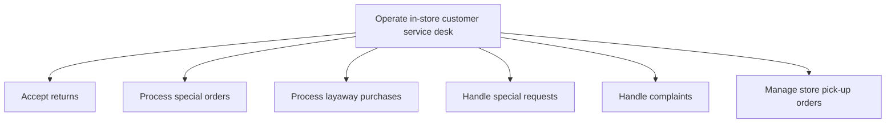

# Operate in-store customer service desk

> TODO: Business-as-Code definition for operate in-store customer service desk (retail)

## Overview

TODO: Add process overview

## Process Hierarchy



## GraphDL

```yaml
operate:
  object: In-store Customer Service Desk
  actor: TODO
  result: TODO
```

## Actions

| Action | Description |
|--------|-------------|
| TODO | TODO |

## Events

| Event | Description |
|-------|-------------|
| TODO | TODO |

## Searches

| Search | Description |
|--------|-------------|
| TODO | TODO |

## Process Flow


## RACI Matrix

| Activity | Responsible | Accountable | Consulted | Informed |
|----------|-------------|-------------|-----------|----------|
| TODO | TODO | TODO | TODO | TODO |

## Sub-Processes

| ID | Name | Description |
|----|------|-------------|
| 2.3.2.1 | Accept returns | TODO |
| 2.3.2.2 | Process special orders | TODO |
| 2.3.2.3 | Process layaway purchases | TODO |
| 2.3.2.4 | Handle special requests | TODO |
| 2.3.2.5 | Handle complaints | TODO |
| 2.3.2.6 | Manage store pick-up orders | TODO |

## Related Processes

| Process | Relationship |
|---------|-------------|
| TODO | TODO |

## Related Departments

| Department | Role |
|-----------|------|
| TODO | TODO |

## Related Occupations

| Occupation | Involvement |
|-----------|-------------|
| TODO | TODO |

## KPIs

| KPI | Description | Unit |
|-----|-------------|------|
| TODO | TODO | TODO |

## Usage

```typescript
import { TODO } from '@headlessly/operate-in-store-customer-service-desk'

const client = TODO()

// TODO: Example action calls
```
