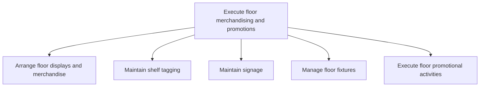

# Execute floor merchandising and promotions

> TODO: Business-as-Code definition for execute floor merchandising and promotions (retail)

## Overview

TODO: Add process overview

## Process Hierarchy



## GraphDL

```yaml
execute:
  object: Floor Merchandising And Promotions
  actor: TODO
  result: TODO
```

## Actions

| Action | Description |
|--------|-------------|
| TODO | TODO |

## Events

| Event | Description |
|-------|-------------|
| TODO | TODO |

## Searches

| Search | Description |
|--------|-------------|
| TODO | TODO |

## Process Flow


## RACI Matrix

| Activity | Responsible | Accountable | Consulted | Informed |
|----------|-------------|-------------|-----------|----------|
| TODO | TODO | TODO | TODO | TODO |

## Sub-Processes

| ID | Name | Description |
|----|------|-------------|
| 2.3.7.1 | Arrange floor displays and merchandise | TODO |
| 2.3.7.2 | Maintain shelf tagging | TODO |
| 2.3.7.3 | Maintain signage | TODO |
| 2.3.7.4 | Manage floor fixtures | TODO |
| 2.3.7.5 | Execute floor promotional activities | TODO |

## Related Processes

| Process | Relationship |
|---------|-------------|
| TODO | TODO |

## Related Departments

| Department | Role |
|-----------|------|
| TODO | TODO |

## Related Occupations

| Occupation | Involvement |
|-----------|-------------|
| TODO | TODO |

## KPIs

| KPI | Description | Unit |
|-----|-------------|------|
| TODO | TODO | TODO |

## Usage

```typescript
import { TODO } from '@headlessly/execute-floor-merchandising-and-promotions'

const client = TODO()

// TODO: Example action calls
```
