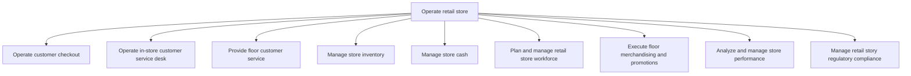

# Operate retail store

> TODO: Business-as-Code definition for operate retail store (retail)

## Overview

TODO: Add process overview

## Process Hierarchy



## GraphDL

```yaml
operate:
  object: Retail Store
  actor: TODO
  result: TODO
```

## Actions

| Action | Description |
|--------|-------------|
| TODO | TODO |

## Events

| Event | Description |
|-------|-------------|
| TODO | TODO |

## Searches

| Search | Description |
|--------|-------------|
| TODO | TODO |

## Process Flow


## RACI Matrix

| Activity | Responsible | Accountable | Consulted | Informed |
|----------|-------------|-------------|-----------|----------|
| TODO | TODO | TODO | TODO | TODO |

## Sub-Processes

| ID | Name | Description |
|----|------|-------------|
| 2.3.1 | Operate customer checkout | TODO |
| 2.3.2 | Operate in-store customer service desk | TODO |
| 2.3.3 | Provide floor customer service | TODO |
| 2.3.4 | Manage store inventory | TODO |
| 2.3.5 | Manage store cash | TODO |
| 2.3.6 | Plan and manage retail store workforce | TODO |
| 2.3.7 | Execute floor merchandising and promotions | TODO |
| 2.3.8 | Analyze and manage store performance | TODO |
| 2.3.9 | Manage retail story regulatory compliance | TODO |

## Related Processes

| Process | Relationship |
|---------|-------------|
| TODO | TODO |

## Related Departments

| Department | Role |
|-----------|------|
| TODO | TODO |

## Related Occupations

| Occupation | Involvement |
|-----------|-------------|
| TODO | TODO |

## KPIs

| KPI | Description | Unit |
|-----|-------------|------|
| TODO | TODO | TODO |

## Usage

```typescript
import { TODO } from '@headlessly/operate-retail-store'

const client = TODO()

// TODO: Example action calls
```
