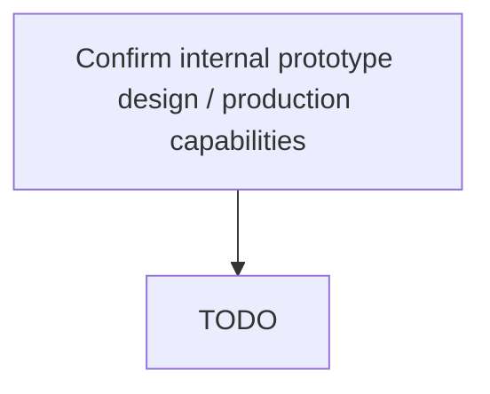

# Confirm internal prototype design / production capabilities

> TODO: Business-as-Code definition for confirm internal prototype design / production capabilities (aerospace-and-defense)

## Overview

Identifying capabilities required to launch new products.   Once capabilities are determined, procurement requirements can be established and procurement processes invoked.  Sourcing strategies are developed in Develop sourcing strategies [10277].

## Process Hierarchy



## GraphDL

```yaml
confirm:
  object: Internal Prototype Design / Production Capabilities
  actor: TODO
  result: TODO
```

## Actions

| Action | Description |
|--------|-------------|
| TODO | TODO |

## Events

| Event | Description |
|-------|-------------|
| TODO | TODO |

## Searches

| Search | Description |
|--------|-------------|
| TODO | TODO |

## Process Flow


## RACI Matrix

| Activity | Responsible | Accountable | Consulted | Informed |
|----------|-------------|-------------|-----------|----------|
| TODO | TODO | TODO | TODO | TODO |

## Related Processes

| Process | Relationship |
|---------|-------------|
| TODO | TODO |

## Related Departments

| Department | Role |
|-----------|------|
| TODO | TODO |

## Related Occupations

| Occupation | Involvement |
|-----------|-------------|
| TODO | TODO |

## KPIs

| KPI | Description | Unit |
|-----|-------------|------|
| TODO | TODO | TODO |

## Usage

```typescript
import { TODO } from '@headlessly/confirm-internal-prototype-design-/-production-capabilities'

const client = TODO()

// TODO: Example action calls
```
