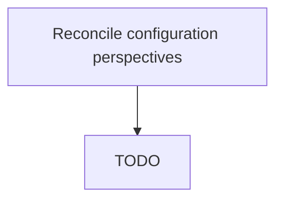

# Reconcile configuration perspectives

> TODO: Business-as-Code definition for reconcile configuration perspectives (aerospace-and-defense)

## Overview

Managing the transition of product configuration perspectives.   As designed - every conceivable version of an aircraft. As sold - specific to customer e.g.,. 10 toilets etc. - what customer has agreed to buy. As engineered = how the org will manufacture what has been sold. As built - what rolls off the production line. As delivered - specific to A&D.  A customer may have their own equipment that they will install on the aircraft when they collect it. As maintained - responsibility for the documentation and configuration of an aircraft is the responsibility of the customer once it has been collected. It is extremely difficult to manage these transitions primarily because the design org, engineering, production orgs use different technologies and have different visions.  Transitioning between them is very complex.

## Process Hierarchy



## GraphDL

```yaml
reconcile:
  object: Configuration Perspectives
  actor: TODO
  result: TODO
```

## Actions

| Action | Description |
|--------|-------------|
| TODO | TODO |

## Events

| Event | Description |
|-------|-------------|
| TODO | TODO |

## Searches

| Search | Description |
|--------|-------------|
| TODO | TODO |

## Process Flow


## RACI Matrix

| Activity | Responsible | Accountable | Consulted | Informed |
|----------|-------------|-------------|-----------|----------|
| TODO | TODO | TODO | TODO | TODO |

## Related Processes

| Process | Relationship |
|---------|-------------|
| TODO | TODO |

## Related Departments

| Department | Role |
|-----------|------|
| TODO | TODO |

## Related Occupations

| Occupation | Involvement |
|-----------|-------------|
| TODO | TODO |

## KPIs

| KPI | Description | Unit |
|-----|-------------|------|
| TODO | TODO | TODO |

## Usage

```typescript
import { TODO } from '@headlessly/reconcile-configuration-perspectives'

const client = TODO()

// TODO: Example action calls
```
