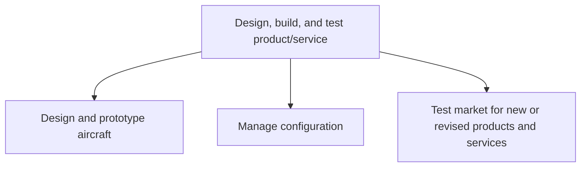

# Design, build, and test product/service

> TODO: Business-as-Code definition for design, build, and test product/service (aerospace-and-defense)

## Overview

TODO: Add process overview

## Process Hierarchy



## GraphDL

```yaml
design,:
  object: Build, And Test Product/service
  actor: TODO
  result: TODO
```

## Actions

| Action | Description |
|--------|-------------|
| TODO | TODO |

## Events

| Event | Description |
|-------|-------------|
| TODO | TODO |

## Searches

| Search | Description |
|--------|-------------|
| TODO | TODO |

## Process Flow


## RACI Matrix

| Activity | Responsible | Accountable | Consulted | Informed |
|----------|-------------|-------------|-----------|----------|
| TODO | TODO | TODO | TODO | TODO |

## Sub-Processes

| ID | Name | Description |
|----|------|-------------|
| 2.3.1 | Design and prototype aircraft | Creating and evaluating new products/services, with the objective of readying them for production. U |
| 2.3.2 | Manage configuration | TODO |
| 2.3.3 | Test market for new or revised products and services | Expanding on the marketplace analysis that took place earlier in the product development lifecycle b |

## Related Processes

| Process | Relationship |
|---------|-------------|
| TODO | TODO |

## Related Departments

| Department | Role |
|-----------|------|
| TODO | TODO |

## Related Occupations

| Occupation | Involvement |
|-----------|-------------|
| TODO | TODO |

## KPIs

| KPI | Description | Unit |
|-----|-------------|------|
| TODO | TODO | TODO |

## Usage

```typescript
import { TODO } from '@headlessly/design,-build,-and-test-product/service'

const client = TODO()

// TODO: Example action calls
```
