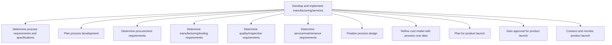

# Develop and implement manufacturing/services

> TODO: Business-as-Code definition for develop and implement manufacturing/services (aerospace-and-defense)

## Overview

TODO: Add process overview

## Process Hierarchy



## GraphDL

```yaml
develop:
  object: And Implement Manufacturing/services
  actor: TODO
  result: TODO
```

## Actions

| Action | Description |
|--------|-------------|
| TODO | TODO |

## Events

| Event | Description |
|-------|-------------|
| TODO | TODO |

## Searches

| Search | Description |
|--------|-------------|
| TODO | TODO |

## Process Flow


## RACI Matrix

| Activity | Responsible | Accountable | Consulted | Informed |
|----------|-------------|-------------|-----------|----------|
| TODO | TODO | TODO | TODO | TODO |

## Sub-Processes

| ID | Name | Description |
|----|------|-------------|
| 2.4.1.1 | Determine process requirements and specifications | TODO |
| 2.4.1.2 | Plan process development | TODO |
| 2.4.1.3 | Determine procurement requirements | TODO |
| 2.4.1.4 | Determine manufacturing/tooling requirements | TODO |
| 2.4.1.5 | Determine quality/inspection requirements | TODO |
| 2.4.1.6 | Determine service/maintenance requirements | TODO |
| 2.4.1.7 | Finalize process design | TODO |
| 2.4.1.8 | Refine cost model with process cost data | TODO |
| 2.4.1.9 | Plan for product launch | TODO |
| 2.4.1.10 | Gain approval for product launch | TODO |
| 2.4.1.11 | Conduct and monitor product launch | Understanding resources for product launch. Identify the need for expansion to deliver products thro |

## Related Processes

| Process | Relationship |
|---------|-------------|
| TODO | TODO |

## Related Departments

| Department | Role |
|-----------|------|
| TODO | TODO |

## Related Occupations

| Occupation | Involvement |
|-----------|-------------|
| TODO | TODO |

## KPIs

| KPI | Description | Unit |
|-----|-------------|------|
| TODO | TODO | TODO |

## Usage

```typescript
import { TODO } from '@headlessly/develop-and-implement-manufacturing/services'

const client = TODO()

// TODO: Example action calls
```
