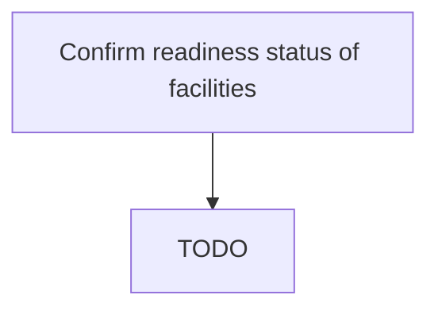

# Confirm readiness status of facilities

> TODO: Business-as-Code definition for confirm readiness status of facilities (aerospace-and-defense)

## Overview

Confirming final assembly line readiness.  Parts and components are built,  then shipped to be assembled in one facility called the final assembly line. Ensure that all elements involved in the generation of the product are complete, tested and ready for operation before the start of production.

## Process Hierarchy



## GraphDL

```yaml
confirm:
  object: Readiness Status Of Facilities
  actor: TODO
  result: TODO
```

## Actions

| Action | Description |
|--------|-------------|
| TODO | TODO |

## Events

| Event | Description |
|-------|-------------|
| TODO | TODO |

## Searches

| Search | Description |
|--------|-------------|
| TODO | TODO |

## Process Flow


## RACI Matrix

| Activity | Responsible | Accountable | Consulted | Informed |
|----------|-------------|-------------|-----------|----------|
| TODO | TODO | TODO | TODO | TODO |

## Related Processes

| Process | Relationship |
|---------|-------------|
| TODO | TODO |

## Related Departments

| Department | Role |
|-----------|------|
| TODO | TODO |

## Related Occupations

| Occupation | Involvement |
|-----------|-------------|
| TODO | TODO |

## KPIs

| KPI | Description | Unit |
|-----|-------------|------|
| TODO | TODO | TODO |

## Usage

```typescript
import { TODO } from '@headlessly/confirm-readiness-status-of-facilities'

const client = TODO()

// TODO: Example action calls
```
