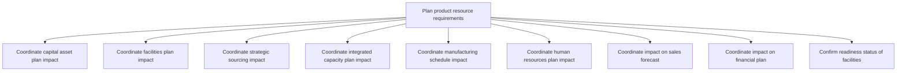

# Plan product resource requirements

> TODO: Business-as-Code definition for plan product resource requirements (aerospace-and-defense)

## Overview

TODO: Add process overview

## Process Hierarchy



## GraphDL

```yaml
plan:
  object: Product Resource Requirements
  actor: TODO
  result: TODO
```

## Actions

| Action | Description |
|--------|-------------|
| TODO | TODO |

## Events

| Event | Description |
|-------|-------------|
| TODO | TODO |

## Searches

| Search | Description |
|--------|-------------|
| TODO | TODO |

## Process Flow


## RACI Matrix

| Activity | Responsible | Accountable | Consulted | Informed |
|----------|-------------|-------------|-----------|----------|
| TODO | TODO | TODO | TODO | TODO |

## Sub-Processes

| ID | Name | Description |
|----|------|-------------|
| 2.4.2.1 | Coordinate capital asset plan impact | TODO |
| 2.4.2.2 | Coordinate facilities plan impact | TODO |
| 2.4.2.3 | Coordinate strategic sourcing impact | TODO |
| 2.4.2.4 | Coordinate integrated capacity plan impact | TODO |
| 2.4.2.5 | Coordinate manufacturing schedule impact | TODO |
| 2.4.2.6 | Coordinate human resources plan impact | TODO |
| 2.4.2.7 | Coordinate impact on sales forecast | TODO |
| 2.4.2.8 | Coordinate impact on financial plan | TODO |
| 2.4.2.9 | Confirm readiness status of facilities | Confirming final assembly line readiness.  Parts and components are built,  then shipped to be assem |

## Related Processes

| Process | Relationship |
|---------|-------------|
| TODO | TODO |

## Related Departments

| Department | Role |
|-----------|------|
| TODO | TODO |

## Related Occupations

| Occupation | Involvement |
|-----------|-------------|
| TODO | TODO |

## KPIs

| KPI | Description | Unit |
|-----|-------------|------|
| TODO | TODO | TODO |

## Usage

```typescript
import { TODO } from '@headlessly/plan-product-resource-requirements'

const client = TODO()

// TODO: Example action calls
```
