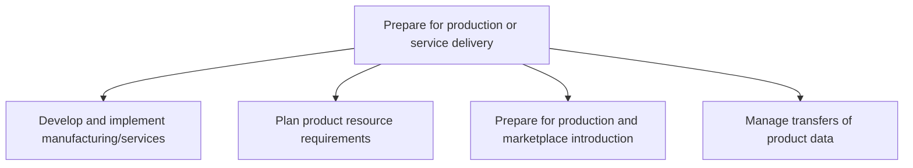

# Prepare for production or service delivery

> TODO: Business-as-Code definition for prepare for production or service delivery (aerospace-and-defense)

## Overview

Understand, design, build, and commission everything required to manufacture finished product.

## Process Hierarchy



## GraphDL

```yaml
prepare:
  object: For Production Or Service Delivery
  actor: TODO
  result: TODO
```

## Actions

| Action | Description |
|--------|-------------|
| TODO | TODO |

## Events

| Event | Description |
|-------|-------------|
| TODO | TODO |

## Searches

| Search | Description |
|--------|-------------|
| TODO | TODO |

## Process Flow


## RACI Matrix

| Activity | Responsible | Accountable | Consulted | Informed |
|----------|-------------|-------------|-----------|----------|
| TODO | TODO | TODO | TODO | TODO |

## Sub-Processes

| ID | Name | Description |
|----|------|-------------|
| 2.4.1 | Develop and implement manufacturing/services | TODO |
| 2.4.2 | Plan product resource requirements | TODO |
| 2.4.3 | Prepare for production and marketplace introduction | TODO |
| 2.4.4 | Manage transfers of product data | TODO |

## Related Processes

| Process | Relationship |
|---------|-------------|
| TODO | TODO |

## Related Departments

| Department | Role |
|-----------|------|
| TODO | TODO |

## Related Occupations

| Occupation | Involvement |
|-----------|-------------|
| TODO | TODO |

## KPIs

| KPI | Description | Unit |
|-----|-------------|------|
| TODO | TODO | TODO |

## Usage

```typescript
import { TODO } from '@headlessly/prepare-for-production-or-service-delivery'

const client = TODO()

// TODO: Example action calls
```
