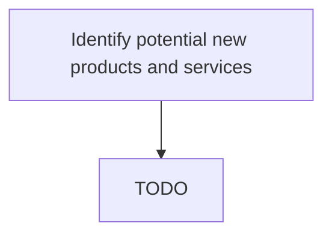

# Identify potential new products and services

> TODO: Business-as-Code definition for identify potential new products and services (airline)

## Overview

Identifying potential value-added solutions. Determine any and all new solutions that can potentially be added to existing products/services in order to best capture value from market opportunities.

## Process Hierarchy



## GraphDL

```yaml
identify:
  object: Potential New Products And Services
  actor: TODO
  result: TODO
```

## Actions

| Action | Description |
|--------|-------------|
| TODO | TODO |

## Events

| Event | Description |
|-------|-------------|
| TODO | TODO |

## Searches

| Search | Description |
|--------|-------------|
| TODO | TODO |

## Process Flow


## RACI Matrix

| Activity | Responsible | Accountable | Consulted | Informed |
|----------|-------------|-------------|-----------|----------|
| TODO | TODO | TODO | TODO | TODO |

## Related Processes

| Process | Relationship |
|---------|-------------|
| TODO | TODO |

## Related Departments

| Department | Role |
|-----------|------|
| TODO | TODO |

## Related Occupations

| Occupation | Involvement |
|-----------|-------------|
| TODO | TODO |

## KPIs

| KPI | Description | Unit |
|-----|-------------|------|
| TODO | TODO | TODO |

## Usage

```typescript
import { TODO } from '@headlessly/identify-potential-new-products-and-services'

const client = TODO()

// TODO: Example action calls
```
