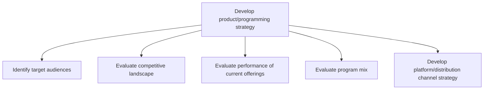

# Develop product/programming strategy

> TODO: Business-as-Code definition for develop product/programming strategy (broadcasting)

## Overview

Designing the product/programming and the determination of how it will be released and distributed by channel (how devices are fed by content) and platform (TVs, tablets, etc.). Identifying the target audience and the evaluation of the competitive landscape, performance of current offerings, and the program mix are established.  The platform/distribution channel strategy is developed to addresses multi-device/platform and multi-channel capabilities that will make content available for consumers to access it any way and by whatever device/platform they choose.  Dependent upon the combination of channel and platform, different formats are required in order for it to be distributed.

## Process Hierarchy



## GraphDL

```yaml
develop:
  object: Product/programming Strategy
  actor: TODO
  result: TODO
```

## Actions

| Action | Description |
|--------|-------------|
| TODO | TODO |

## Events

| Event | Description |
|-------|-------------|
| TODO | TODO |

## Searches

| Search | Description |
|--------|-------------|
| TODO | TODO |

## Process Flow


## RACI Matrix

| Activity | Responsible | Accountable | Consulted | Informed |
|----------|-------------|-------------|-----------|----------|
| TODO | TODO | TODO | TODO | TODO |

## Sub-Processes

| ID | Name | Description |
|----|------|-------------|
| 2.1.1 | Identify target audiences | TODO |
| 2.1.2 | Evaluate competitive landscape | TODO |
| 2.1.3 | Evaluate performance of current offerings | TODO |
| 2.1.4 | Evaluate program mix | TODO |
| 2.1.5 | Develop platform/distribution channel strategy | TODO |

## Related Processes

| Process | Relationship |
|---------|-------------|
| TODO | TODO |

## Related Departments

| Department | Role |
|-----------|------|
| TODO | TODO |

## Related Occupations

| Occupation | Involvement |
|-----------|-------------|
| TODO | TODO |

## KPIs

| KPI | Description | Unit |
|-----|-------------|------|
| TODO | TODO | TODO |

## Usage

```typescript
import { TODO } from '@headlessly/develop-product/programming-strategy'

const client = TODO()

// TODO: Example action calls
```
