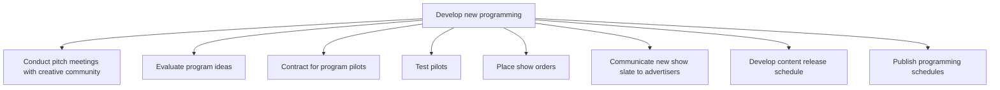

# Develop new programming

> TODO: Business-as-Code definition for develop new programming (broadcasting)

## Overview

Developing and managing new programming from pitching a concept to publishing program scheduling. The creative community conducts pitch meetings to generate and discuss new program ideas, which are then evaluated. The programming networks shop for services from third party producers, and either these producers or an in-house production company will handle the production of pilots for successful ideas.  Contracts are entered into and the pilots are developed using Conduct content pre-production activities [13134]. The testing of the idea/pilot is managed by the network, a new slate of shows is communicated to advertisers, and a content release schedule is produced and published.  The development of the content release schedule is coordinated with the marketing/sales resources in Evaluate content release schedules [19839].  Campaigns will be developed based on the schedule.

## Process Hierarchy



## GraphDL

```yaml
develop:
  object: New Programming
  actor: TODO
  result: TODO
```

## Actions

| Action | Description |
|--------|-------------|
| TODO | TODO |

## Events

| Event | Description |
|-------|-------------|
| TODO | TODO |

## Searches

| Search | Description |
|--------|-------------|
| TODO | TODO |

## Process Flow


## RACI Matrix

| Activity | Responsible | Accountable | Consulted | Informed |
|----------|-------------|-------------|-----------|----------|
| TODO | TODO | TODO | TODO | TODO |

## Sub-Processes

| ID | Name | Description |
|----|------|-------------|
| 2.2.1 | Conduct pitch meetings with creative community | TODO |
| 2.2.2 | Evaluate program ideas | TODO |
| 2.2.3 | Contract for program pilots | TODO |
| 2.2.4 | Test pilots | TODO |
| 2.2.5 | Place show orders | TODO |
| 2.2.6 | Communicate new show slate to advertisers | TODO |
| 2.2.7 | Develop content release schedule | Developing a schedule when inventory will be sold by the studio or producer, and when the sales orga |
| 2.2.8 | Publish programming schedules | TODO |

## Related Processes

| Process | Relationship |
|---------|-------------|
| TODO | TODO |

## Related Departments

| Department | Role |
|-----------|------|
| TODO | TODO |

## Related Occupations

| Occupation | Involvement |
|-----------|-------------|
| TODO | TODO |

## KPIs

| KPI | Description | Unit |
|-----|-------------|------|
| TODO | TODO | TODO |

## Usage

```typescript
import { TODO } from '@headlessly/develop-new-programming'

const client = TODO()

// TODO: Example action calls
```
