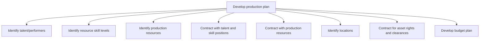

# Develop production plan

> TODO: Business-as-Code definition for develop production plan (broadcasting)

## Overview

TODO: Add process overview

## Process Hierarchy



## GraphDL

```yaml
develop:
  object: Production Plan
  actor: TODO
  result: TODO
```

## Actions

| Action | Description |
|--------|-------------|
| TODO | TODO |

## Events

| Event | Description |
|-------|-------------|
| TODO | TODO |

## Searches

| Search | Description |
|--------|-------------|
| TODO | TODO |

## Process Flow


## RACI Matrix

| Activity | Responsible | Accountable | Consulted | Informed |
|----------|-------------|-------------|-----------|----------|
| TODO | TODO | TODO | TODO | TODO |

## Sub-Processes

| ID | Name | Description |
|----|------|-------------|
| 2.3.2.1 | Identify talent/performers | TODO |
| 2.3.2.2 | Identify resource skill levels | TODO |
| 2.3.2.3 | Identify production resources | TODO |
| 2.3.2.4 | Contract with talent and skill positions | TODO |
| 2.3.2.5 | Contract with production resources | TODO |
| 2.3.2.6 | Identify locations | TODO |
| 2.3.2.7 | Contract for asset rights and clearances | TODO |
| 2.3.2.8 | Develop budget plan | TODO |

## Related Processes

| Process | Relationship |
|---------|-------------|
| TODO | TODO |

## Related Departments

| Department | Role |
|-----------|------|
| TODO | TODO |

## Related Occupations

| Occupation | Involvement |
|-----------|-------------|
| TODO | TODO |

## KPIs

| KPI | Description | Unit |
|-----|-------------|------|
| TODO | TODO | TODO |

## Usage

```typescript
import { TODO } from '@headlessly/develop-production-plan'

const client = TODO()

// TODO: Example action calls
```
