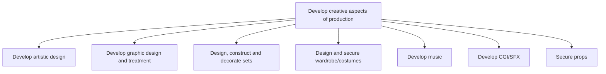

# Develop creative aspects of production

> TODO: Business-as-Code definition for develop creative aspects of production (broadcasting)

## Overview

TODO: Add process overview

## Process Hierarchy



## GraphDL

```yaml
develop:
  object: Creative Aspects Of Production
  actor: TODO
  result: TODO
```

## Actions

| Action | Description |
|--------|-------------|
| TODO | TODO |

## Events

| Event | Description |
|-------|-------------|
| TODO | TODO |

## Searches

| Search | Description |
|--------|-------------|
| TODO | TODO |

## Process Flow


## RACI Matrix

| Activity | Responsible | Accountable | Consulted | Informed |
|----------|-------------|-------------|-----------|----------|
| TODO | TODO | TODO | TODO | TODO |

## Sub-Processes

| ID | Name | Description |
|----|------|-------------|
| 2.3.5.1 | Develop artistic design | TODO |
| 2.3.5.2 | Develop graphic design and treatment | TODO |
| 2.3.5.3 | Design, construct and decorate sets | TODO |
| 2.3.5.4 | Design and secure wardrobe/costumes | TODO |
| 2.3.5.5 | Develop music | TODO |
| 2.3.5.6 | Develop CGI/SFX | TODO |
| 2.3.5.7 | Secure props | TODO |

## Related Processes

| Process | Relationship |
|---------|-------------|
| TODO | TODO |

## Related Departments

| Department | Role |
|-----------|------|
| TODO | TODO |

## Related Occupations

| Occupation | Involvement |
|-----------|-------------|
| TODO | TODO |

## KPIs

| KPI | Description | Unit |
|-----|-------------|------|
| TODO | TODO | TODO |

## Usage

```typescript
import { TODO } from '@headlessly/develop-creative-aspects-of-production'

const client = TODO()

// TODO: Example action calls
```
