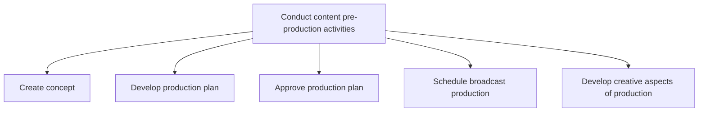

# Conduct content pre-production activities

> TODO: Business-as-Code definition for conduct content pre-production activities (broadcasting)

## Overview

Establishing the concept and production activities for broadcasting.  Create contracts with skilled resources/talent and the contracting for asset rights and clearances. Coordinate with Procure content and services [10216] to approve scripts as well as the financial budget; arrange production financing and contracting with/for locations, facilities, and crews. Develop artistic design; graphic design and treatment; set, props, and wardrobe design; and the development of the music and special effects.

## Process Hierarchy



## GraphDL

```yaml
conduct:
  object: Content Pre-production Activities
  actor: TODO
  result: TODO
```

## Actions

| Action | Description |
|--------|-------------|
| TODO | TODO |

## Events

| Event | Description |
|-------|-------------|
| TODO | TODO |

## Searches

| Search | Description |
|--------|-------------|
| TODO | TODO |

## Process Flow


## RACI Matrix

| Activity | Responsible | Accountable | Consulted | Informed |
|----------|-------------|-------------|-----------|----------|
| TODO | TODO | TODO | TODO | TODO |

## Sub-Processes

| ID | Name | Description |
|----|------|-------------|
| 2.3.1 | Create concept | TODO |
| 2.3.2 | Develop production plan | TODO |
| 2.3.3 | Approve production plan | TODO |
| 2.3.4 | Schedule broadcast production | TODO |
| 2.3.5 | Develop creative aspects of production | TODO |

## Related Processes

| Process | Relationship |
|---------|-------------|
| TODO | TODO |

## Related Departments

| Department | Role |
|-----------|------|
| TODO | TODO |

## Related Occupations

| Occupation | Involvement |
|-----------|-------------|
| TODO | TODO |

## KPIs

| KPI | Description | Unit |
|-----|-------------|------|
| TODO | TODO | TODO |

## Usage

```typescript
import { TODO } from '@headlessly/conduct-content-pre-production-activities'

const client = TODO()

// TODO: Example action calls
```
