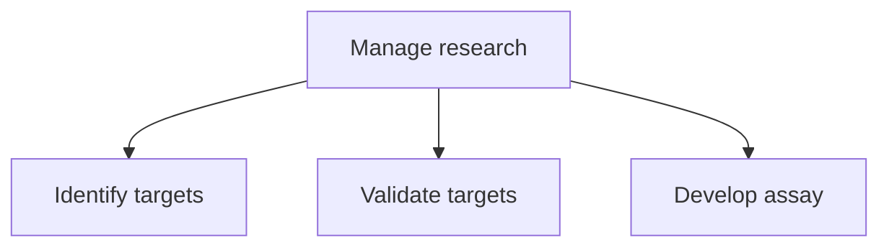

# Manage research

> TODO: Business-as-Code definition for manage research (life-sciences)

## Overview

Identifying and validating a target such as a drug or biochemical substance, or a cell in an organism or organic sample and ends with the development of an assay.  An assay is an investigative (analytic) procedure in laboratory medicine, pharmacology, environmental biology, and molecular biology for qualitatively assessing or quantitatively measuring the presence or amount or the functional activity of the identified target.

## Process Hierarchy



## GraphDL

```yaml
manage:
  object: Research
  actor: TODO
  result: TODO
```

## Actions

| Action | Description |
|--------|-------------|
| TODO | TODO |

## Events

| Event | Description |
|-------|-------------|
| TODO | TODO |

## Searches

| Search | Description |
|--------|-------------|
| TODO | TODO |

## Process Flow


## RACI Matrix

| Activity | Responsible | Accountable | Consulted | Informed |
|----------|-------------|-------------|-----------|----------|
| TODO | TODO | TODO | TODO | TODO |

## Sub-Processes

| ID | Name | Description |
|----|------|-------------|
| 2.2.1.1 | Identify targets | TODO |
| 2.2.1.2 | Validate targets | TODO |
| 2.2.1.3 | Develop assay | TODO |

## Related Processes

| Process | Relationship |
|---------|-------------|
| TODO | TODO |

## Related Departments

| Department | Role |
|-----------|------|
| TODO | TODO |

## Related Occupations

| Occupation | Involvement |
|-----------|-------------|
| TODO | TODO |

## KPIs

| KPI | Description | Unit |
|-----|-------------|------|
| TODO | TODO | TODO |

## Usage

```typescript
import { TODO } from '@headlessly/manage-research'

const client = TODO()

// TODO: Example action calls
```
