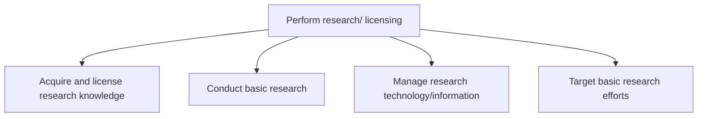

# Perform research/ licensing

> TODO: Business-as-Code definition for perform research/ licensing (life-sciences)

## Overview

Performing acquisition and licensing of research knowledge, conducting basic research, and managing the corresponding technology and information to enable the targeting of the basic research efforts.

## Process Hierarchy



## GraphDL

```yaml
perform:
  object: Research/ Licensing
  actor: TODO
  result: TODO
```

## Actions

| Action | Description |
|--------|-------------|
| TODO | TODO |

## Events

| Event | Description |
|-------|-------------|
| TODO | TODO |

## Searches

| Search | Description |
|--------|-------------|
| TODO | TODO |

## Process Flow


## RACI Matrix

| Activity | Responsible | Accountable | Consulted | Informed |
|----------|-------------|-------------|-----------|----------|
| TODO | TODO | TODO | TODO | TODO |

## Sub-Processes

| ID | Name | Description |
|----|------|-------------|
| 2.2.2.1 | Acquire and license research knowledge | TODO |
| 2.2.2.2 | Conduct basic research | TODO |
| 2.2.2.3 | Manage research technology/information | TODO |
| 2.2.2.4 | Target basic research efforts | TODO |

## Related Processes

| Process | Relationship |
|---------|-------------|
| TODO | TODO |

## Related Departments

| Department | Role |
|-----------|------|
| TODO | TODO |

## Related Occupations

| Occupation | Involvement |
|-----------|-------------|
| TODO | TODO |

## KPIs

| KPI | Description | Unit |
|-----|-------------|------|
| TODO | TODO | TODO |

## Usage

```typescript
import { TODO } from '@headlessly/perform-research/-licensing'

const client = TODO()

// TODO: Example action calls
```
