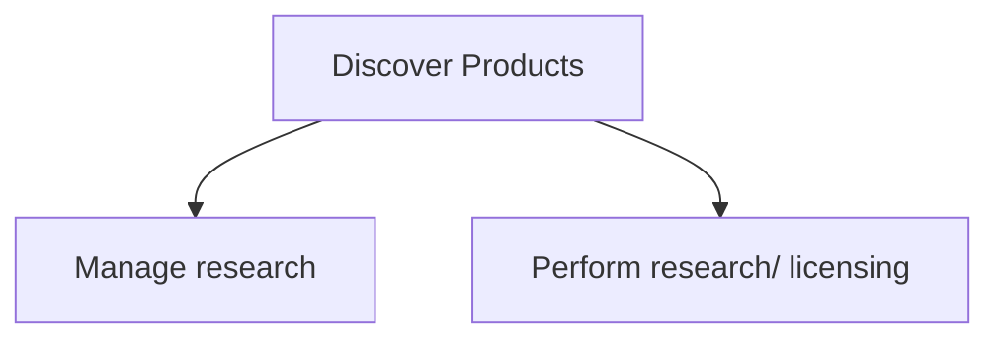

# Discover Products

> TODO: Business-as-Code definition for discover products (life-sciences)

## Overview

Managing and executing of research into and licensing of new products.

## Process Hierarchy



## GraphDL

```yaml
discover:
  object: Products
  actor: TODO
  result: TODO
```

## Actions

| Action | Description |
|--------|-------------|
| TODO | TODO |

## Events

| Event | Description |
|-------|-------------|
| TODO | TODO |

## Searches

| Search | Description |
|--------|-------------|
| TODO | TODO |

## Process Flow


## RACI Matrix

| Activity | Responsible | Accountable | Consulted | Informed |
|----------|-------------|-------------|-----------|----------|
| TODO | TODO | TODO | TODO | TODO |

## Sub-Processes

| ID | Name | Description |
|----|------|-------------|
| 2.2.1 | Manage research | Identifying and validating a target such as a drug or biochemical substance, or a cell in an organis |
| 2.2.2 | Perform research/ licensing | Performing acquisition and licensing of research knowledge, conducting basic research, and managing  |

## Related Processes

| Process | Relationship |
|---------|-------------|
| TODO | TODO |

## Related Departments

| Department | Role |
|-----------|------|
| TODO | TODO |

## Related Occupations

| Occupation | Involvement |
|-----------|-------------|
| TODO | TODO |

## KPIs

| KPI | Description | Unit |
|-----|-------------|------|
| TODO | TODO | TODO |

## Usage

```typescript
import { TODO } from '@headlessly/discover-products'

const client = TODO()

// TODO: Example action calls
```
