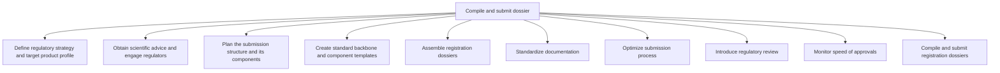

# Compile and submit dossier

> TODO: Business-as-Code definition for compile and submit dossier (life-sciences)

## Overview

Defining regulatory strategy and new product profile and planning the structure (and components) of the registration dossier that is ultimately submitted to the regulatory authorities for approval.  The standard backbone and component templates of the dossier are created.  E.g., an eCTD (electronic Common Technical Document), a global standard that is comprised of 5 modules that is filed when a new drug application, is to be investigated. The dossiers are then assembled, the documentation (templates, metadata and formatting) standardized, and the lifecycle states and dates of the dossier and its components are tracked against the submission plan so that the submission process can be optimized.  Regulatory reviewers look at the documentation for non-clinical and CMC (Chemistry Manufacturing Control) submission components.  The registration dossier is compiled and submitted, and the speed of approvals is monitored.

## Process Hierarchy



## GraphDL

```yaml
compile:
  object: And Submit Dossier
  actor: TODO
  result: TODO
```

## Actions

| Action | Description |
|--------|-------------|
| TODO | TODO |

## Events

| Event | Description |
|-------|-------------|
| TODO | TODO |

## Searches

| Search | Description |
|--------|-------------|
| TODO | TODO |

## Process Flow


## RACI Matrix

| Activity | Responsible | Accountable | Consulted | Informed |
|----------|-------------|-------------|-----------|----------|
| TODO | TODO | TODO | TODO | TODO |

## Sub-Processes

| ID | Name | Description |
|----|------|-------------|
| 2.4.4.1 | Define regulatory strategy and target product profile | TODO |
| 2.4.4.2 | Obtain scientific advice and engage regulators | TODO |
| 2.4.4.3 | Plan the submission structure and its components | TODO |
| 2.4.4.4 | Create standard backbone and component templates | TODO |
| 2.4.4.5 | Assemble registration dossiers | TODO |
| 2.4.4.6 | Standardize documentation | TODO |
| 2.4.4.7 | Optimize submission process | TODO |
| 2.4.4.8 | Introduce regulatory review | TODO |
| 2.4.4.9 | Monitor speed of approvals | TODO |
| 2.4.4.10 | Compile and submit registration dossiers | TODO |

## Related Processes

| Process | Relationship |
|---------|-------------|
| TODO | TODO |

## Related Departments

| Department | Role |
|-----------|------|
| TODO | TODO |

## Related Occupations

| Occupation | Involvement |
|-----------|-------------|
| TODO | TODO |

## KPIs

| KPI | Description | Unit |
|-----|-------------|------|
| TODO | TODO | TODO |

## Usage

```typescript
import { TODO } from '@headlessly/compile-and-submit-dossier'

const client = TODO()

// TODO: Example action calls
```
