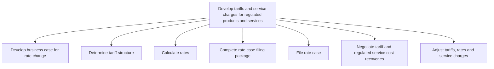

# Develop tariffs and service charges for regulated products and services

> TODO: Business-as-Code definition for develop tariffs and service charges for regulated products and services (utilities)

## Overview

TODO: Add process overview

## Process Hierarchy



## GraphDL

```yaml
develop:
  object: Tariffs And Service Charges For Regulated Products And Services
  actor: TODO
  result: TODO
```

## Actions

| Action | Description |
|--------|-------------|
| TODO | TODO |

## Events

| Event | Description |
|-------|-------------|
| TODO | TODO |

## Searches

| Search | Description |
|--------|-------------|
| TODO | TODO |

## Process Flow


## RACI Matrix

| Activity | Responsible | Accountable | Consulted | Informed |
|----------|-------------|-------------|-----------|----------|
| TODO | TODO | TODO | TODO | TODO |

## Sub-Processes

| ID | Name | Description |
|----|------|-------------|
| 2.4.1 | Develop business case for rate change | TODO |
| 2.4.2 | Determine tariff structure | TODO |
| 2.4.3 | Calculate rates | TODO |
| 2.4.4 | Complete rate case filing package | TODO |
| 2.4.5 | File rate case | TODO |
| 2.4.6 | Negotiate tariff and regulated service cost recoveries | TODO |
| 2.4.7 | Adjust tariffs, rates and service charges | TODO |

## Related Processes

| Process | Relationship |
|---------|-------------|
| TODO | TODO |

## Related Departments

| Department | Role |
|-----------|------|
| TODO | TODO |

## Related Occupations

| Occupation | Involvement |
|-----------|-------------|
| TODO | TODO |

## KPIs

| KPI | Description | Unit |
|-----|-------------|------|
| TODO | TODO | TODO |

## Usage

```typescript
import { TODO } from '@headlessly/develop-tariffs-and-service-charges-for-regulated-products-and-services'

const client = TODO()

// TODO: Example action calls
```
