# Assess, design, build, and evaluate upstream petroleum-related technologies

> TODO: Business-as-Code definition for assess, design, build, and evaluate upstream petroleum-related technologies (petroleum-upstream)

## Overview

TODO: Add process overview

## Process Hierarchy

```mermaid
graph TD
    A[Assess, design, build, and evaluate upstream petroleum-related technologies]
    A --> B[Assign resources to upstream petroleum-related technology project]
    A --> C[Identify existing solutions to be leveraged]
    A --> D[Prepare high-level business case and technical assessment]
    A --> E[Develop asset specific upstream petroleum-related technology design specifications]
    A --> F[Develop user experience design specifications]
    A --> G[Provide warranty-related recommendations]
    A --> H[Document design specifications]
    A --> I[Conduct Front End Design and Engineering FEED]
    A --> J[Design products/services]
    A --> K[Build prototypes/proof of concepts]
    A --> L[Evaluate prototype in the field and evaluate feasibility for wider deployment]
    A --> M[Eliminate quality and reliability problems]
    A --> N[Identify design/development performance indicators]
    A --> O[Collaborate on design with suppliers and contract manufacturers to produce product]
```



## GraphDL

```yaml
assess,:
  object: Design, Build, And Evaluate Upstream Petroleum-related Technologies
  actor: TODO
  result: TODO
```

## Actions

| Action | Description |
|--------|-------------|
| TODO | TODO |

## Events

| Event | Description |
|-------|-------------|
| TODO | TODO |

## Searches

| Search | Description |
|--------|-------------|
| TODO | TODO |

## Process Flow


## RACI Matrix

| Activity | Responsible | Accountable | Consulted | Informed |
|----------|-------------|-------------|-----------|----------|
| TODO | TODO | TODO | TODO | TODO |

## Sub-Processes

| ID | Name | Description |
|----|------|-------------|
| 2.3.1.1 | Assign resources to upstream petroleum-related technology project | TODO |
| 2.3.1.2 | Identify existing solutions to be leveraged | TODO |
| 2.3.1.3 | Prepare high-level business case and technical assessment | TODO |
| 2.3.1.4 | Develop asset specific upstream petroleum-related technology design specifications | TODO |
| 2.3.1.5 | Develop user experience design specifications | TODO |
| 2.3.1.6 | Provide warranty-related recommendations | TODO |
| 2.3.1.7 | Document design specifications | TODO |
| 2.3.1.8 | Conduct Front End Design and Engineering FEED | TODO |
| 2.3.1.9 | Design products/services | TODO |
| 2.3.1.10 | Build prototypes/proof of concepts | TODO |
| 2.3.1.11 | Evaluate prototype in the field and evaluate feasibility for wider deployment | TODO |
| 2.3.1.12 | Eliminate quality and reliability problems | TODO |
| 2.3.1.13 | Identify design/development performance indicators | TODO |
| 2.3.1.14 | Collaborate on design with suppliers and contract manufacturers to produce product | TODO |

## Related Processes

| Process | Relationship |
|---------|-------------|
| TODO | TODO |

## Related Departments

| Department | Role |
|-----------|------|
| TODO | TODO |

## Related Occupations

| Occupation | Involvement |
|-----------|-------------|
| TODO | TODO |

## KPIs

| KPI | Description | Unit |
|-----|-------------|------|
| TODO | TODO | TODO |

## Usage

```typescript
import { TODO } from '@headlessly/assess,-design,-build,-and-evaluate-upstream-petroleum-related-technologies'

const client = TODO()

// TODO: Example action calls
```
